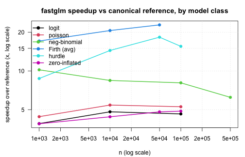

<!-- README.md is generated from README.Rmd. Please edit that file -->

```{r, echo = FALSE}
knitr::opts_chunk$set(
  collapse = TRUE,
  warning = FALSE,
  message = FALSE,
  tidy = FALSE,
  fig.align = 'center',
  comment = "#>",
  fig.path = "man/figures/README-"
)
```

[](https://cran.r-project.org/package=fastglm)
[](https://cran.r-project.org/package=fastglm)

# fastglm

The *fastglm* package is a **fast** and **stable** alternative to `stats::glm()` for fitting generalized linear models. It is built on *RcppEigen* and is fully compatible with R's `family` objects: the downstream methods you expect (`summary()`, `vcov()`, `predict()`, `coef()`, `residuals()`, `logLik()`) all work exactly as they do for a `glm`.

Beyond standard GLMs, *fastglm* provides dedicated entry points for negative-binomial regression, hurdle and zero-inflated count models, and Firth bias-reduced GLMs, all of which reuse the same C++ IRLS solver.

### Features

- Six decomposition methods for the IRLS weighted least-squares step: column-pivoted QR (default, rank-revealing), unpivoted QR, LLT Cholesky, LDLT Cholesky, full-pivoted QR, and bidiagonal divide-and-conquer SVD.
- Robust convergence via step-halving safeguard following Marschner (2011), with better-initialized starting values than `glm()` or `glm2()`.
- Large scale data features: Sparse design matrices (`Matrix::dgCMatrix`), on-disc `big.matrix` objects (`bigmemory`), and a streaming callback interface (`fastglm_streaming()`) for fitting on data that does not fit in memory.
- Firth bias-reduced GLMs (`firth = TRUE`) implementing the AS_mean adjustment of Kosmidis and Firth (2009, 2021) for all standard families, all six decomposition methods, and all three large-data paths.
- Negative-binomial regression (`fastglm_nb()`) with joint `(beta, theta)` MLE entirely in C++.
- Hurdle count models (`fastglm_hurdle()`) with Poisson or NB count components and a binary zero/non-zero component.
- Zero-inflated count models (`fastglm_zi()`) with Poisson or NB count distributions, fit by an EM algorithm in C++.
- Inference: `vcov()`, `summary()`, `predict(se.fit = TRUE)`, and compatibility with `sandwich::vcovHC()` and `sandwich::vcovCL()` for robust standard errors.

## Installation

Install from CRAN:

```{r, eval = FALSE}
install.packages("fastglm")
```

or the development version from GitHub:

```{r, eval = FALSE}
pak::pak("jaredhuling/fastglm")
```

## Fitting a GLM

The main function is `fastglm()`. It takes a numeric design matrix `x`, a response `y`, and an R `family` object:

```{r}
library(fastglm)

data(esoph)
x <- model.matrix(~ agegp + unclass(tobgp) + unclass(alcgp), data = esoph)
y <- cbind(esoph$ncases, esoph$ncontrols)

fit <- fastglm(x, y, family = binomial(link = "cloglog"))
summary(fit)
```

`fastglm()` operates on a pre-built design matrix. To use a formula and a data frame, pass `fastglm_fit` as the fitting function to base `glm()`:

```{r}
fit2 <- glm(cbind(ncases, ncontrols) ~ agegp + unclass(tobgp) + unclass(alcgp),
            data = esoph, family = binomial(link = "cloglog"),
            method = fastglm_fit)
```

A third, minimal-use function, `fastglmPure()`, returns only the coefficient vector and working quantities, skipping dispersion, AIC, and null-deviance computation. Use this when calling *fastglm* from another package and you only need the coefficients.

## Decomposition methods

The IRLS algorithm reduces every iteration to a weighted least-squares problem. *fastglm* supports six different matrix decompositions for solving that WLS step, all from *RcppEigen* (Bates and Eddelbuettel, 2013); the choice trades off speed against numerical stability and rank-revealing behavior:

| `method` | decomposition |
|---|---|
| `0` | column-pivoted Householder QR (default; rank-revealing) |
| `1` | unpivoted Householder QR |
| `2` | LLT Cholesky |
| `3` | LDLT Cholesky |
| `4` | full-pivoted Householder QR |
| `5` | bidiagonal divide-and-conquer SVD |

The default (`method = 0`) is the safe choice: it is rank-revealing, so it handles aliased or collinear columns gracefully. The Cholesky methods (`2` and `3`) are roughly 3--4x faster but assume full column rank.

```{r}
set.seed(123)
n <- 5000; p <- 30
x <- matrix(rnorm(n * p), n, p)
y <- rbinom(n, 1, plogis(x %*% rnorm(p) * 0.05))

system.time(f0 <- fastglm(x, y, family = binomial()))                 # default QR
system.time(f2 <- fastglm(x, y, family = binomial(), method = 2))     # LLT
```

## Speed

*fastglm* runs the same IRLS algorithm as `glm.fit()` but executes the per-iteration WLS solve in C++ via *RcppEigen*, which is often substantially faster than the compiled-R + LAPACK path that `glm.fit()` uses. The gap widens with sample size because the R-side overhead in `glm.fit()` is fixed per iteration:

```{r glm_bench, echo = TRUE, out.width = "100%", fig.width = 9, fig.height = 5}
library(microbenchmark)
library(ggplot2)

set.seed(123)
n.obs  <- 10000
n.vars <- 100

x <- matrix(rnorm(n.obs * n.vars, sd = 3), n.obs, n.vars)
y <- 1 * (drop(x[, 1:25] %*% runif(25, -0.1, 0.1)) > rnorm(n.obs))

ct <- microbenchmark(
    glm.fit          = glm.fit(x, y, family = binomial()),
    fastglm_QR       = fastglm(x, y, family = binomial(), method = 0),
    fastglm_LLT      = fastglm(x, y, family = binomial(), method = 2),
    fastglm_LDLT     = fastglm(x, y, family = binomial(), method = 3),
    times = 25L
)

autoplot(ct, log = FALSE) +
    ggplot2::stat_summary(fun = median, geom = 'point', size = 2) +
    ggplot2::theme_bw()
```

Coefficient estimates agree with `glm.fit()` to floating-point precision:

```{r}
gl <- glm.fit(x, y, family = binomial())
c(fastglm_QR   = max(abs(coef(gl) - coef(fastglm(x, y, family = binomial(), method = 0)))),
  fastglm_LLT  = max(abs(coef(gl) - coef(fastglm(x, y, family = binomial(), method = 2)))),
  fastglm_LDLT = max(abs(coef(gl) - coef(fastglm(x, y, family = binomial(), method = 3)))))
```

## Stability

*fastglm* does not compromise computational stability for speed. It uses a step-halving safeguard following Marschner (2011) and starts from better-initialized values than `glm()` or `glm2::glm2()`, so it tends to converge in cases where the standard IRLS algorithm fails. As an example, consider a Gamma model with a `sqrt` link --- a mild response misspecification combined with a badly misspecified link. In such scenarios the standard IRLS algorithm tends to have convergence issues:

```{r}
set.seed(1)
x <- matrix(rnorm(10000 * 100), ncol = 100)
y <- (exp(0.25 * x[,1] - 0.25 * x[,3] + 0.5 * x[,4] - 0.5 * x[,5] + rnorm(10000))) + 0.1

gfit1 <- glm(y ~ x, family = Gamma(link = "sqrt"), method = fastglm_fit)
gfit2 <- glm(y ~ x, family = Gamma(link = "sqrt"))

## fastglm converges with a higher likelihood
c(fastglm_converged = gfit1$converged, glm_converged = gfit2$converged)
c(fastglm_logLik = logLik(gfit1), glm_logLik = logLik(gfit2))
```

See `vignette("fastglm", package = "fastglm")` for the full comparison, including `glm2::glm2()` and `speedglm`.

## Native C++ families

For the most commonly used `family`/`link` combinations, *fastglm* dispatches `variance()`, `mu.eta()`, `linkinv()`, and `dev.resids()` to inline C++ implementations rather than calling back into R once per IRLS iteration. The covered combinations are:

- gaussian (identity, log, inverse)
- binomial (logit, probit, cloglog, log)
- poisson (log, identity, sqrt)
- Gamma (log, inverse, identity)
- inverse.gaussian (1/mu^2, log, identity, inverse)

Detection is automatic: if the `family` object matches one of the above, the native path is used; otherwise *fastglm* falls back to the R-callback path. The C++ native approach is meaningfully faster on large `n` because it eliminates the per-iteration calls to R for each of the four family functions.

## Sparse, big.matrix, and streaming designs

For designs that are sparse, that live on disc, or that have to be built from a parquet / *arrow* / *DuckDB* source, *fastglm* provides three large-data paths that share a common streaming kernel and produce identical results:

- **`Matrix::dgCMatrix`**: pass directly to `fastglm()`. Useful for one-hot encoded categoricals and high-dimensional sparse designs.
- **`bigmemory::big.matrix`**: pass directly to `fastglm()`. The matrix is read in row-blocks and never fully materialized in memory.
- **`fastglm_streaming(chunk_callback, n_chunks, family)`**: a user-supplied closure yields one row-block per call. The right path for fitting on a parquet dataset, *DuckDB* query, or any external columnar store.

A short example of the streaming computation approach:

```{r}
n <- 4000
X <- cbind(1, matrix(rnorm(n * 3), n, 3))
y <- rbinom(n, 1, plogis(X %*% c(0.2, 0.4, -0.2, 0.3)))

chunk_size <- 1000
chunks <- function(k) {
    idx <- ((k - 1) * chunk_size + 1):(k * chunk_size)
    list(X = X[idx, , drop = FALSE], y = y[idx])
}

fit_stream <- fastglm_streaming(chunks, n_chunks = 4, family = binomial())
fit_full   <- fastglm(X, y, family = binomial(), method = 2)

max(abs(coef(fit_stream) - coef(fit_full)))
```

See `vignette("large-data-fastglm", package = "fastglm")` for a detailed walk-through of all three paths.

## Extended models

### Negative-binomial regression

`fastglm_nb()` fits negative-binomial regression with the dispersion `theta` estimated jointly with the regression coefficients, in the spirit of `MASS::glm.nb()`. The joint `(beta, theta)` MLE runs entirely in C++; IRLS for `beta`, Brent's method for `theta`:

```{r}
set.seed(123)
n <- 5000
X <- cbind(1, matrix(rnorm(n * 3), n, 3))
mu <- exp(X %*% c(0.5, 0.4, -0.2, 0.3))
y <- MASS::rnegbin(n, mu = mu, theta = 2)

f_nb <- fastglm_nb(X, y)
c(coef = coef(f_nb), theta = f_nb$theta)
```

### Hurdle models

`fastglm_hurdle()` fits a two-part count model: a binary regression for whether `y > 0`, plus a zero-truncated Poisson or NB regression on the positive subset. The two parts factorize and both are fit by the same C++ IRLS solver. This is the same model as `pscl::hurdle()` (Zeileis, Kleiber, and Jackman, 2008). Different designs for the count and zero parts are specified via the `Formula` package's two-RHS syntax:

```{r}
set.seed(123)
n <- 5000
x1 <- rnorm(n);  x2 <- rnorm(n)
lam <- exp(0.7 + 0.4 * x1 - 0.3 * x2)
is_pos <- rbinom(n, 1, plogis(-0.4 + 0.5 * x1 + 0.2 * x2))
yt <- integer(n)
for (i in seq_len(n)) {
    repeat { v <- rpois(1, lam[i]); if (v > 0) { yt[i] <- v; break } }
}
y <- ifelse(is_pos == 1, yt, 0L)

f_h <- fastglm_hurdle(y ~ x1 + x2, data = data.frame(y, x1, x2), dist = "poisson")
coef(f_h)
```

### Zero-inflated models

`fastglm_zi()` fits a zero-inflated Poisson or NB regression, a binary inflation component overlaid on the original count distribution, fit by an EM algorithm in C++ with closed-form posterior responsibilities and an analytical observed-information `vcov`. This is the same model as `pscl::zeroinfl()`:

```{r}
set.seed(123)
n <- 5000
x1 <- rnorm(n);  x2 <- rnorm(n)
eta_c <- 0.7 + 0.4 * x1 - 0.3 * x2
eta_z <- -0.4 + 0.5 * x1 + 0.2 * x2
z <- rbinom(n, 1, plogis(eta_z))
y <- ifelse(z == 1, 0L, rpois(n, exp(eta_c)))

f_zi <- fastglm_zi(y ~ x1 + x2, data = data.frame(y, x1, x2), dist = "poisson")
coef(f_zi)
```

### Firth bias-reduced GLMs

Setting `firth = TRUE` activates the general mean-bias reduction of Kosmidis and Firth (2009, 2021). This extends Firth's (1993) original logistic penalty to arbitrary GLM families, producing finite estimates even under separation and removing the leading $O(1/n)$ bias from maximum likelihood estimates:

```{r}
data(sex2, package = "logistf")
X <- model.matrix(~ age + oc + vic + vicl + vis + dia, data = sex2)
y <- sex2$case

f_firth <- fastglm(X, y, family = binomial(), firth = TRUE)
coef(f_firth)
```

Firth bias reduction works with all six decomposition methods, all standard R families and link functions, and all three large-data paths (sparse, big.matrix, streaming). See `vignette("firth-fastglm", package = "fastglm")` for verification against `logistf::logistf()` and `brglm2::brglmFit()`.

## Inference

The fitted object stores the unscaled covariance directly, so `vcov()` and `summary()` work as expected. Heteroskedasticity-consistent and cluster-robust covariance matrices are available via `sandwich::vcovHC()` and `sandwich::vcovCL()`, *fastglm* registers methods on those generics, so loading *sandwich* is all that is required:

```{r, eval = FALSE}
library(sandwich)
V_hc <- vcovHC(fit, type = "HC0")
V_cl <- vcovCL(fit, cluster = cluster, type = "HC1")
```

Results are numerically identical to `sandwich` applied to a `glm` fit to floating-point precision. `predict()` supports `se.fit = TRUE`:

```{r, eval = FALSE}
predict(fit, newdata = xnew, type = "response", se.fit = TRUE)
```

## Benchmarks

A comprehensive benchmarking study is available in `vignette("benchmarks-fastglm", package = "fastglm")`, comparing *fastglm* against the canonical reference implementations across standard GLMs (`glm.fit`, `glm2`, `speedglm`), negative-binomial regression (`MASS::glm.nb`), Firth bias-reduced GLMs (`brglm2`, `logistf`), and hurdle / zero-inflated count regressions (`pscl::hurdle`, `pscl::zeroinfl`).

The following summary plot shows the speedup *fastglm* delivers over the canonical reference for each model class, as a function of sample size. The reference for the standard GLMs is the fastest among `glm.fit`, `glm2`, and `speedglm`, so the comparison is conservative. Larger is better:



Across all model classes the same picture holds: *fastglm* matches the canonical reference implementation to floating-point precision, and the runtime gap grows with sample size. By $n = 10^5$ the speedup is generally an order of magnitude or more. For models with an outer iteration (NB joint MLE, hurdle/ZI with NB), the gap is widest, since the entire outer loop is in C++ in *fastglm* and entirely in R in the reference implementations.

## References

- Firth, D. (1993). Bias reduction of maximum likelihood estimates. *Biometrika*, 80(1), 27--38.

- Kosmidis, I. and Firth, D. (2009). Bias reduction in exponential family nonlinear models. *Biometrika*, 96(4), 793--804.

- Kosmidis, I. and Firth, D. (2021). Jeffreys-prior penalty, finiteness and shrinkage in binomial-response generalized linear models. *Biometrika*, 108(1), 71--82.

- Marschner, I. C. (2011). glm2: Fitting generalized linear models with convergence problems. *The R Journal*, 3(2), 12--15.

- Bates, D. and Eddelbuettel, D. (2013). Fast and elegant numerical linear algebra using the RcppEigen package. *Journal of Statistical Software*, 52(5), 1--24.

- Zeileis, A., Kleiber, C., and Jackman, S. (2008). Regression models for count data in R. *Journal of Statistical Software*, 27(8), 1--25.
