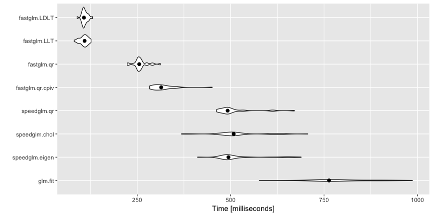

[](https://travis-ci.org/jaredhuling/fastglm)

# Overview of 'fastglm'

The 'fastglm' package is a re-write of `glm()` using `RcppEigen` designed to be computationally efficient.


# Installing the 'fastglm' package


Install the development version using the **devtools** package:

```r
devtools::install_github("jaredhuling/fastglm")
```

or by cloning and building using `R CMD INSTALL`

# Quick Usage Overview

Load the package:

```r
library(fastglm)
```

A (not comprehensive) comparison with `glm.fit()` and `speedglm.wfit()`:


```r
library(speedglm)
library(microbenchmark)
library(ggplot2)

set.seed(123)
n.obs  <- 10000
n.vars <- 100
x <- matrix(rnorm(n.obs * n.vars, sd = 3), n.obs, n.vars)

y <- 1 * ( drop(x[,1:25] %*% runif(25, min = -0.1, max = 0.10)) > rnorm(n.obs))

ct <- microbenchmark(
    glm.fit = {gl1 <- glm.fit(x, y, family = binomial())},
    speedglm.eigen  = {sg1 <- speedglm.wfit(y, x, intercept = FALSE,
                                            family = binomial())},
    speedglm.chol   = {sg2 <- speedglm.wfit(y, x, intercept = FALSE, 
                                            family = binomial(), method = "Chol")},
    speedglm.qr     = {sg3 <- speedglm.wfit(y, x, intercept = FALSE,
                                            family = binomial(), method = "qr")},
    fastglm.qr.cpiv = {gf1 <- fastglm(x, y, family = binomial())},
    fastglm.qr      = {gf2 <- fastglm(x, y, family = binomial(), method = 1)},
    fastglm.LLT     = {gf3 <- fastglm(x, y, family = binomial(), method = 2)},
    fastglm.LDLT    = {gf4 <- fastglm(x, y, family = binomial(), method = 3)},
    times = 25L
)

autoplot(ct) + stat_summary(fun.y = median, geom = 'point', size = 2)
```



```r
# comparison of estimates
max(abs(coef(gl1) - gf1$coef))
```

```
## [1] 9.436896e-16
```

```r
max(abs(coef(gl1) - gf2$coef))
```

```
## [1] 9.436896e-16
```

```r
max(abs(coef(gl1) - gf3$coef))
```

```
## [1] 8.326673e-16
```

```r
max(abs(coef(gl1) - gf4$coef))
```

```
## [1] 9.15934e-16
```

```r
# now between glm and speedglm
max(abs(coef(gl1) - sg1$coef))
```

```
## [1] 1.387779e-15
```

```r
max(abs(coef(gl1) - sg2$coef))
```

```
## [1] 1.387779e-15
```

```r
max(abs(coef(gl1) - sg3$coef))
```

```
## [1] 1.471046e-15
```
