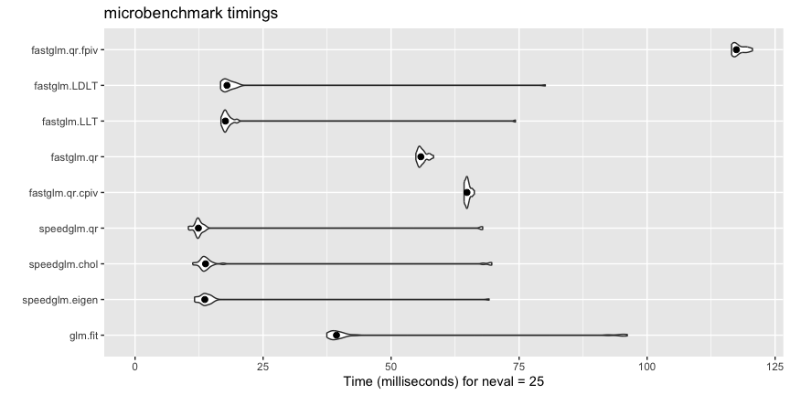

<!-- README.md is generated from README.Rmd. Please edit that file -->

[](https://cran.r-project.org/package=fastglm)

# Overview of *fastglm*

The *fastglm* package is a re-write of `glm()` using *RcppEigen*
designed to be computationally efficient and algorithmically stable.

# Installing the *fastglm* package

*fastglm* can be installed using *pak*:

``` r
pak::pak("fastglm")
# pak::pak("jaredhuling/fastglm") #development version
```

or by cloning and building using `R CMD INSTALL`.

# Quick Usage Overview

Load the package:

``` r
library(fastglm)
```

A (not comprehensive) comparison with `glm.fit()` and `speedglm.wfit()`:

``` r
library(speedglm)
library(microbenchmark)
library(ggplot2)

set.seed(123)
n.obs  <- 10000
n.vars <- 100
x <- matrix(rnorm(n.obs * n.vars, sd = 3), n.obs, n.vars)
Sigma <- 0.99 ^ abs(outer(1:n.vars, 1:n.vars, FUN = "-"))
x <- MASS::mvrnorm(n.obs, mu = runif(n.vars, min = -1), Sigma = Sigma)

y <- 1 * ( drop(x[,1:25] %*% runif(25, min = -0.1, max = 0.10)) > rnorm(n.obs))

ct <- microbenchmark(
    glm.fit =         {gl1 <- glm.fit(x, y, family = binomial())},
    speedglm.eigen  = {sg1 <- speedglm.wfit(y, x, intercept = FALSE,
                                            family = binomial())},
    speedglm.chol   = {sg2 <- speedglm.wfit(y, x, intercept = FALSE, 
                                            family = binomial(), method = "Chol")},
    speedglm.qr     = {sg3 <- speedglm.wfit(y, x, intercept = FALSE,
                                            family = binomial(), method = "qr")},
    fastglm.qr.cpiv = {gf1 <- fastglm(x, y, family = binomial())},
    fastglm.qr      = {gf2 <- fastglm(x, y, family = binomial(), method = 1)},
    fastglm.LLT     = {gf3 <- fastglm(x, y, family = binomial(), method = 2)},
    fastglm.LDLT    = {gf4 <- fastglm(x, y, family = binomial(), method = 3)},
    fastglm.qr.fpiv = {gf5 <- fastglm(x, y, family = binomial(), method = 4)},
    times = 25L
)

autoplot(ct, log = FALSE) +
    stat_summary(fun.y = median, geom = 'point', size = 2)
```



``` r
# comparison of estimates
c(glm_vs_fastglm_qrcpiv = max(abs(coef(gl1) - gf1$coef)),
  glm_vs_fastglm_qr     = max(abs(coef(gl1) - gf2$coef)),
  glm_vs_fastglm_qrfpiv = max(abs(coef(gl1) - gf5$coef)),
  glm_vs_fastglm_LLT    = max(abs(coef(gl1) - gf3$coef)),
  glm_vs_fastglm_LDLT   = max(abs(coef(gl1) - gf4$coef)))
```

    ## glm_vs_fastglm_qrcpiv     glm_vs_fastglm_qr glm_vs_fastglm_qrfpiv 
    ##          8.881784e-15          9.936496e-15          1.204592e-14 
    ##    glm_vs_fastglm_LLT   glm_vs_fastglm_LDLT 
    ##          1.202649e-13          2.076672e-13

``` r
# now between glm and speedglm
c(glm_vs_speedglm_eigen = max(abs(coef(gl1) - sg1$coef)),
  glm_vs_speedglm_Chol  = max(abs(coef(gl1) - sg2$coef)),
  glm_vs_speedglm_qr    = max(abs(coef(gl1) - sg3$coef)))
```

    ## glm_vs_speedglm_eigen  glm_vs_speedglm_Chol    glm_vs_speedglm_qr 
    ##          1.259048e-12          1.259048e-12          1.320777e-12

# Stability

The *fastglm* package does not compromise computational stability for
speed. In fact, for many situations where `glm()` and even
`glm2::glm2()` do not converge, `fastglm()` does converge.

As an example, consider the following data scenario, where the response
distribution is (mildly) misspecified, but the link function is quite
badly misspecified. In such scenarios, the standard IRLS algorithm tends
to have convergence issues. The `glm2()` package was designed to handle
such cases, however, it still can have convergence issues. The
`fastglm()` package uses a similar step-halving technique as `glm2()`,
but it starts at better initialized values and thus tends to have better
convergence properties in practice.

``` r
set.seed(1)
x <- matrix(rnorm(10000 * 100), ncol = 100)
y <- (exp(0.25 * x[,1] - 0.25 * x[,3] + 0.5 * x[,4] - 0.5 * x[,5] + rnorm(10000)) ) + 0.1


system.time(gfit1 <- glm(y ~ x, family = Gamma(link = "sqrt"),
                         method = fastglm.fit))
```

    ##    user  system elapsed 
    ##   0.261   0.005   0.267

``` r
system.time(gfit2 <- glm(y ~ x, family = Gamma(link = "sqrt")))
```

    ##    user  system elapsed 
    ##   0.387   0.025   0.412

``` r
system.time(gfit3 <- glm2::glm2(y ~ x, family = Gamma(link = "sqrt")))
```

    ##    user  system elapsed 
    ##   0.267   0.019   0.288

``` r
system.time(gfit4 <- speedglm(y ~ x, family = Gamma(link = "sqrt")))
```

    ##    user  system elapsed 
    ##   0.067   0.012   0.079

``` r
## speedglm appears to diverge
system.time(gfit5 <- speedglm(y ~ x, family = Gamma(link = "sqrt"),
                              maxit = 500))
```

    ##    user  system elapsed 
    ##   1.215   0.195   1.411

``` r
## Note that fastglm() returns estimates with the
## largest likelihood

c(fastglm     = logLik(gfit1),
  glm         = logLik(gfit2),
  glm2        = logLik(gfit3),
  speedglm    = logLik(gfit4),
  speedglm500 = logLik(gfit5))
```

    ##     fastglm         glm        glm2    speedglm speedglm500 
    ##   -16030.81   -16704.05   -16046.66   -36423.35   -70953.78

``` r
rbind(fastglm     = coef(gfit1)[1:5],
      glm         = coef(gfit2)[1:5],
      glm2        = coef(gfit3)[1:5],
      speedglm    = coef(gfit4)[1:5],
      speedglm500 = coef(gfit5)[1:5])
```

    ##             (Intercept)        x1            x2         x3         x4
    ## fastglm      1.42925957 0.1258714  5.311209e-03 -0.1293960  0.2389508
    ## glm          1.43116799 0.1251936 -6.896739e-05 -0.1281857  0.2366473
    ## glm2         1.42686381 0.1242616 -9.860241e-05 -0.1254873  0.2361301
    ## speedglm    -4.56190855 5.0654671 -4.844225e+00 -0.9470766 -5.8183704
    ## speedglm500 -0.00159227 1.3962876  8.377002e+00 -1.2283816  0.1281007

``` r
## check convergence of fastglm and #iterations
# 1 means converged, 0 means not converged
c(gfit1$converged, gfit1$iter)
```

    ## [1]  1 15

``` r
## now check convergence for glm()
c(gfit2$converged, gfit2$iter)
```

    ## [1]  0 25

``` r
## check convergence for glm2()
c(gfit3$converged, gfit3$iter)
```

    ## [1]  1 19

``` r
## check convergence for speedglm()
c(gfit4$convergence, gfit4$iter, gfit5$convergence, gfit5$iter)
```

    ## [1]   0  25   0 500

``` r
## increasing number of IRLS iterations for glm() does not help that much
system.time(gfit2 <- glm(y ~ x, family = Gamma(link = "sqrt"),
                         maxit = 1000))
```

    ##    user  system elapsed 
    ##  10.559   0.966  11.538

``` r
gfit2$converged
```

    ## [1] FALSE

``` r
gfit2$iter
```

    ## [1] 1000

``` r
logLik(gfit1)
```

    ## 'log Lik.' -16030.81 (df=102)

``` r
logLik(gfit2)
```

    ## 'log Lik.' -26232.17 (df=102)
