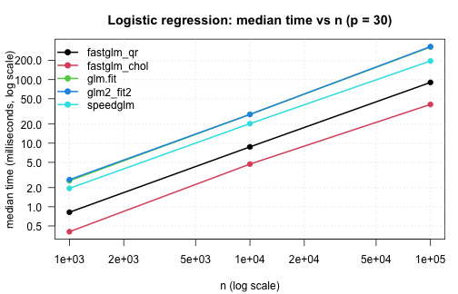
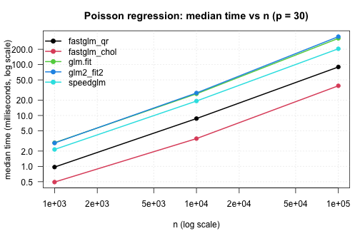
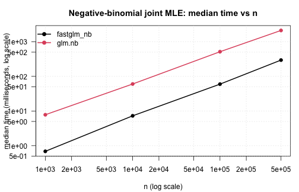
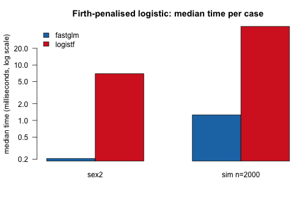
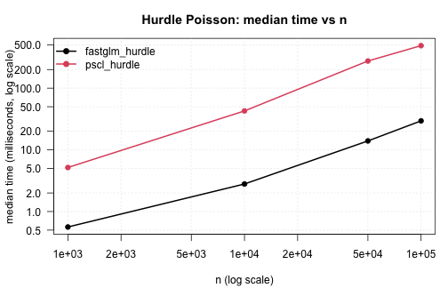
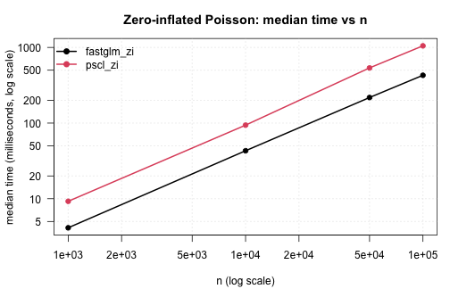
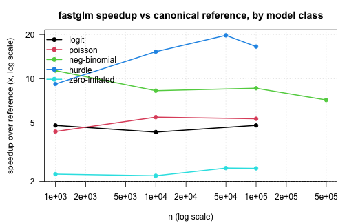

This vignette is a more comprehensive benchmarking study than the small inline timings in the other vignettes. It compares *fastglm* against the canonical reference implementations across a range of sample sizes and model classes:

- standard GLMs against `stats::glm()`, `glm2::glm.fit2()`, and `speedglm::speedglm.wfit()`,
- the sparse and `big.matrix` solver paths against the dense path,
- negative-binomial regression against `MASS::glm.nb()`,
- Firth-penalized logistic against `logistf::logistf()`,
- hurdle and zero-inflated count regressions against `pscl::hurdle()` and `pscl::zeroinfl()`.

To re-run the benchmarks (after a code change, on a different machine, etc.), execute `vignettes/_precompile.R` from the package root.


``` r
library(fastglm)
suppressPackageStartupMessages({
    library(MASS)
    library(pscl)
    library(logistf)
    library(speedglm)
    library(Matrix)
    library(bigmemory)
    library(microbenchmark)
})

bench_unit <- "milliseconds"
.fmt <- function(mb) {
    s <- summary(mb, unit = bench_unit)
    s <- s[, c("expr", "min", "median", "mean", "max")]
    names(s) <- c("expr", "min (ms)", "median (ms)", "mean (ms)", "max (ms)")
    s
}
.collect <- function(mb, n) {
    s <- summary(mb, unit = bench_unit)
    data.frame(n = n, expr = as.character(s$expr), median = s$median,
               stringsAsFactors = FALSE)
}
.plot_scaling <- function(df, title) {
    methods <- unique(df$expr)
    cols    <- seq_along(methods)
    op <- par(mar = c(4.2, 4.2, 3, 1), las = 1)
    on.exit(par(op), add = TRUE)
    plot(NA, log = "xy",
         xlim = range(df$n), ylim = range(df$median),
         xlab = "n (log scale)",
         ylab = paste0("median time (", bench_unit, ", log scale)"),
         main = title)
    grid(equilogs = FALSE, col = "gray85")
    for (k in seq_along(methods)) {
        sub <- df[df$expr == methods[k], ]
        sub <- sub[order(sub$n), ]
        lines (sub$n, sub$median, col = cols[k], lwd = 2)
        points(sub$n, sub$median, col = cols[k], pch = 19)
    }
    legend("topleft", legend = methods, col = cols,
           pch = 19, lty = 1, lwd = 2, bty = "n")
}
sessionInfo()
#> R version 4.5.1 (2025-06-13)
#> Platform: aarch64-apple-darwin20
#> Running under: macOS Sequoia 15.7.3
#> 
#> Matrix products: default
#> BLAS:   /Library/Frameworks/R.framework/Versions/4.5-arm64/Resources/lib/libRblas.0.dylib 
#> LAPACK: /Library/Frameworks/R.framework/Versions/4.5-arm64/Resources/lib/libRlapack.dylib;  LAPACK version 3.12.1
#> 
#> locale:
#> [1] en_US.UTF-8/en_US.UTF-8/en_US.UTF-8/C/en_US.UTF-8/en_US.UTF-8
#> 
#> time zone: America/Chicago
#> tzcode source: internal
#> 
#> attached base packages:
#> [1] stats     graphics  grDevices utils     datasets  methods   base     
#> 
#> other attached packages:
#>  [1] microbenchmark_1.5.0 bigmemory_4.6.4      speedglm_0.3-5      
#>  [4] biglm_0.9-3          DBI_1.2.3            Matrix_1.7-5        
#>  [7] logistf_1.26.1       pscl_1.5.9           MASS_7.3-65         
#> [10] fastglm_0.0.5       
#> 
#> loaded via a namespace (and not attached):
#>  [1] sandwich_3.1-1         generics_0.1.4         tidyr_1.3.1           
#>  [4] shape_1.4.6.1          lattice_0.22-7         lme4_1.1-37           
#>  [7] magrittr_2.0.4         mitml_0.4-5            estimability_1.5.1    
#> [10] evaluate_1.0.4         grid_4.5.1             iterators_1.0.14      
#> [13] mice_3.18.0            mvtnorm_1.3-3          foreach_1.5.2         
#> [16] jomo_2.7-6             operator.tools_1.6.3.1 glmnet_4.1-10         
#> [19] nnet_7.3-20            backports_1.5.0        survival_3.8-3        
#> [22] multcomp_1.4-28        mgcv_1.9-3             purrr_1.2.1           
#> [25] bigmemory.sri_0.1.8    TH.data_1.1-3          codetools_0.2-20      
#> [28] reformulas_0.4.1       Rdpack_2.6.4           cli_3.6.5             
#> [31] rlang_1.1.7            rbibutils_2.3          splines_4.5.1         
#> [34] pan_1.9                tools_4.5.1            uuid_1.2-1            
#> [37] nloptr_2.2.1           minqa_1.2.8            dplyr_1.1.4           
#> [40] boot_1.3-31            broom_1.0.12           vctrs_0.7.2           
#> [43] R6_2.6.1               rpart_4.1.24           zoo_1.8-14            
#> [46] emmeans_1.11.2         lifecycle_1.0.4        pkgconfig_2.0.3       
#> [49] pillar_1.11.1          glue_1.8.0             Rcpp_1.1.0            
#> [52] xfun_0.52              tibble_3.3.0           tidyselect_1.2.1      
#> [55] knitr_1.50             xtable_1.8-4           nlme_3.1-168          
#> [58] formula.tools_1.7.1    compiler_4.5.1
```

# Standard GLMs

Logistic regression with an increasing number of observations, holding `p = 30` fixed. Comparing the default *fastglm* path (`method = 0`, pivoted QR), the LLT-Cholesky path (`method = 2`), `stats::glm.fit()`, `glm2::glm.fit2()`, and `speedglm::speedglm.wfit()`.


``` r
set.seed(1)
p <- 30

run_one_logit <- function(n) {
    X <- matrix(rnorm(n * p), n, p)
    beta <- rnorm(p) * 0.05
    y <- rbinom(n, 1, plogis(X %*% beta))
    microbenchmark(
        fastglm_qr   = fastglm(X, y, family = binomial(),            method = 0),
        fastglm_chol = fastglm(X, y, family = binomial(),            method = 2),
        glm.fit      = glm.fit(X, y, family = binomial()),
        glm2_fit2    = glm2::glm.fit2(X, y, family = binomial()),
        speedglm     = speedglm::speedglm.wfit(y = y, X = X,
                                               family = binomial(),
                                               intercept = FALSE),
        times = 5L
    )
}

logit_tim <- list()
for (n in c(1e3, 1e4, 1e5)) {
    cat("\n--- n =", n, "---\n")
    mb <- run_one_logit(n)
    print(.fmt(mb))
    logit_tim[[length(logit_tim) + 1]] <- .collect(mb, n)
}
#> 
#> --- n = 1000 ---
#>           expr min (ms) median (ms) mean (ms) max (ms)
#> 1   fastglm_qr 0.782649    0.820000 1.0789150 2.105022
#> 2 fastglm_chol 0.396552    0.405285 0.4147232 0.455674
#> 3      glm.fit 2.432202    2.562992 2.9429800 4.450960
#> 4    glm2_fit2 2.499114    2.670330 2.9793962 4.506105
#> 5     speedglm 1.928189    1.949714 2.4329318 4.355225
#> 
#> --- n = 10000 ---
#>           expr  min (ms) median (ms) mean (ms)  max (ms)
#> 1   fastglm_qr  8.585072    8.746571  8.860674  9.280924
#> 2 fastglm_chol  3.426247    4.690400 14.163278 53.598890
#> 3      glm.fit 27.636501   28.415173 28.887140 30.403837
#> 4    glm2_fit2 26.937287   28.327351 28.159472 28.958751
#> 5     speedglm 19.654744   20.303077 21.238689 24.291106
#> 
#> --- n = 1e+05 ---
#>           expr  min (ms) median (ms) mean (ms)  max (ms)
#> 1   fastglm_qr  89.25753    90.25970  91.00553  95.08548
#> 2 fastglm_chol  37.25432    40.74473  40.27186  41.78884
#> 3      glm.fit 284.38035   325.13812 335.31097 419.44287
#> 4    glm2_fit2 326.96004   330.35184 341.28560 382.65243
#> 5     speedglm 192.51038   196.15589 215.62233 249.94162
logit_tim <- do.call(rbind, logit_tim)
.plot_scaling(logit_tim, "Logistic regression: median time vs n (p = 30)")
```



The same comparison for Poisson regression with a log link:


``` r
run_one_poisson <- function(n) {
    X <- matrix(rnorm(n * p), n, p)
    beta <- rnorm(p) * 0.05
    y <- rpois(n, exp(X %*% beta + 1))
    microbenchmark(
        fastglm_qr   = fastglm(X, y, family = poisson(),            method = 0),
        fastglm_chol = fastglm(X, y, family = poisson(),            method = 2),
        glm.fit      = glm.fit(X, y, family = poisson()),
        glm2_fit2    = glm2::glm.fit2(X, y, family = poisson()),
        speedglm     = speedglm::speedglm.wfit(y = y, X = X,
                                               family = poisson(),
                                               intercept = FALSE),
        times = 5L
    )
}

pois_tim <- list()
for (n in c(1e3, 1e4, 1e5)) {
    cat("\n--- n =", n, "---\n")
    mb <- run_one_poisson(n)
    print(.fmt(mb))
    pois_tim[[length(pois_tim) + 1]] <- .collect(mb, n)
}
#> 
#> --- n = 1000 ---
#>           expr min (ms) median (ms) mean (ms) max (ms)
#> 1   fastglm_qr 0.868954    0.969281 1.0339708 1.424545
#> 2 fastglm_chol 0.477650    0.491836 0.5633072 0.865428
#> 3      glm.fit 2.641138    2.913706 3.0120322 3.630304
#> 4    glm2_fit2 2.721662    2.880168 2.8681304 3.035230
#> 5     speedglm 2.068327    2.149589 2.2176162 2.455203
#> 
#> --- n = 10000 ---
#>           expr  min (ms) median (ms) mean (ms)  max (ms)
#> 1   fastglm_qr  8.404467    8.701348  9.718296 13.499168
#> 2 fastglm_chol  3.310258    3.514110  3.615282  3.915787
#> 3      glm.fit 26.118312   26.669311 28.270172 31.484064
#> 4    glm2_fit2 26.971112   27.684020 28.347859 31.823749
#> 5     speedglm 19.046714   19.233592 19.286884 19.661427
#> 
#> --- n = 1e+05 ---
#>           expr  min (ms) median (ms) mean (ms)  max (ms)
#> 1   fastglm_qr  89.36057    89.80078 100.39996 141.35496
#> 2 fastglm_chol  36.22313    38.34779  38.18333  39.22138
#> 3      glm.fit 325.01807   327.65740 330.18867 344.74932
#> 4    glm2_fit2 278.52657   354.66779 363.70979 433.98287
#> 5     speedglm 199.96290   204.68049 227.75442 284.12988
pois_tim <- do.call(rbind, pois_tim)
.plot_scaling(pois_tim, "Poisson regression: median time vs n (p = 30)")
```



The Cholesky paths are 3&ndash;5x faster than `glm.fit()` at moderate `n` and the gap widens with sample size &mdash; the IRLS structure is the same, but each iteration's WLS solve is materially cheaper in *RcppEigen* than in compiled R + LAPACK. *speedglm* is competitive at small `n` but its single-threaded cross-product accumulation overtakes the savings as `n` grows, since *fastglm* lets Eigen parallelise the WLS solve.

# Sparse and big.matrix paths

A sparse design matrix from one-hot encoding a 100-level factor against a continuous covariate. The column count is `p = 200`; *fastglm* on the dense matrix has to materialise all 200 columns explicitly, while the sparse path only operates on the non-zero entries:


``` r
set.seed(2)
n   <- 5e4
g   <- factor(sample.int(100, n, replace = TRUE))
xn  <- rnorm(n)
Xd  <- model.matrix(~ g * xn)
Xs  <- as(Xd, "CsparseMatrix")
betas <- rnorm(ncol(Xd)) / 4
y   <- rbinom(n, 1, plogis(Xd %*% betas))

mb_sparse <- microbenchmark(
    fastglm_dense  = fastglm(Xd, y, family = binomial(), method = 2),
    fastglm_sparse = fastglm(Xs, y, family = binomial(), method = 2),
    times = 5L
)
print(.fmt(mb_sparse))
#>             expr min (ms) median (ms) mean (ms) max (ms)
#> 1  fastglm_dense 218.7811    220.4451  222.2950 227.3766
#> 2 fastglm_sparse 247.9938    262.4799  268.1184 307.9439

cat("ncol(Xd) =", ncol(Xd), "  fraction nonzero =",
    round(length(Xs@x) / prod(dim(Xs)), 3), "\n")
#> ncol(Xd) = 200   fraction nonzero = 0.02
```

A `big.matrix` comparison on a moderately large dense design &mdash; `n = 5e5`, `p = 20`. The on-disc `big.matrix` runs in row-blocks but produces identical estimates:


``` r
set.seed(3)
n  <- 5e5
p  <- 20
X  <- matrix(rnorm(n * p), n, p)
Xb <- as.big.matrix(X)
y  <- rbinom(n, 1, plogis(X %*% rnorm(p) * 0.05))

mb_big <- microbenchmark(
    dense       = fastglm(X,  y, family = binomial(), method = 2),
    big.matrix  = fastglm(Xb, y, family = binomial(), method = 2),
    times = 3L
)
print(.fmt(mb_big))
#>         expr min (ms) median (ms) mean (ms) max (ms)
#> 1      dense 129.0053    136.7083  136.9545 145.1500
#> 2 big.matrix 141.8254    142.1299  142.3005 142.9463

f1 <- fastglm(X,  y, family = binomial(), method = 2)
f2 <- fastglm(Xb, y, family = binomial(), method = 2)
cat("max coef diff:", max(abs(coef(f1) - coef(f2))), "\n")
#> max coef diff: 1.19349e-15
```

The dense path is faster for matrices that fit in RAM (the row-block reads have non-zero overhead), but the `big.matrix` path is the only viable option once the design exceeds available memory.

# Negative-binomial regression

`fastglm_nb()` against `MASS::glm.nb()` across a range of sample sizes. The data-generating process is NB(`mu`, `theta = 2`) with three covariates and an intercept:


``` r
set.seed(4)
run_one_nb <- function(n) {
    X  <- cbind(1, matrix(rnorm(n * 3), n, 3))
    mu <- exp(X %*% c(0.5, 0.4, -0.2, 0.3))
    y  <- MASS::rnegbin(n, mu = mu, theta = 2)
    df <- data.frame(y = y, x1 = X[, 2], x2 = X[, 3], x3 = X[, 4])
    microbenchmark(
        fastglm_nb = fastglm_nb(X, y),
        glm.nb     = MASS::glm.nb(y ~ x1 + x2 + x3, data = df),
        times = 5L
    )
}

nb_tim <- list()
for (n in c(1e3, 1e4, 1e5, 5e5)) {
    cat("\n--- n =", n, "---\n")
    mb <- run_one_nb(n)
    print(.fmt(mb))
    nb_tim[[length(nb_tim) + 1]] <- .collect(mb, n)
}
#> 
#> --- n = 1000 ---
#>         expr min (ms) median (ms) mean (ms) max (ms)
#> 1 fastglm_nb 0.611515    0.686873 0.9694204 2.219494
#> 2     glm.nb 7.588854    7.803079 7.7879828 8.017263
#> 
#> --- n = 10000 ---
#>         expr  min (ms) median (ms) mean (ms)  max (ms)
#> 1 fastglm_nb  6.882834    7.264339   7.26912  7.707754
#> 2     glm.nb 59.773449   60.203990  62.97967 69.503487
#> 
#> --- n = 1e+05 ---
#>         expr  min (ms) median (ms) mean (ms)  max (ms)
#> 1 fastglm_nb  58.78539    59.63278   62.1734  72.74929
#> 2     glm.nb 511.89140   513.57281  525.5684 568.34331
#> 
#> --- n = 5e+05 ---
#>         expr  min (ms) median (ms) mean (ms)  max (ms)
#> 1 fastglm_nb  292.6352    294.9895  296.1172  300.6103
#> 2     glm.nb 2049.1221   2113.7185 2114.2318 2191.1647
nb_tim <- do.call(rbind, nb_tim)
.plot_scaling(nb_tim, "Negative-binomial joint MLE: median time vs n")
```



Accuracy on the largest case: coefficients and `theta` agree to floating-point precision against `glm.nb`, since both maximise the same likelihood. The runtime difference is structural &mdash; `glm.nb` runs its IRLS + theta-MLE alternation in R, *fastglm_nb* runs both loops in C++.


``` r
set.seed(99)
n  <- 5e5
X  <- cbind(1, matrix(rnorm(n * 3), n, 3))
mu <- exp(X %*% c(0.5, 0.4, -0.2, 0.3))
y  <- MASS::rnegbin(n, mu = mu, theta = 2)
df <- data.frame(y = y, x1 = X[, 2], x2 = X[, 3], x3 = X[, 4])
f_nb <- fastglm_nb(X, y)
m_nb <- MASS::glm.nb(y ~ x1 + x2 + x3, data = df)
cat("coef max abs diff:", max(abs(unname(coef(f_nb)) - unname(coef(m_nb)))), "\n")
#> coef max abs diff: 2.930989e-14
cat("theta diff       :", abs(f_nb$theta - m_nb$theta), "\n")
#> theta diff       : 3.095302e-13
cat("logLik diff      :",
    abs(as.numeric(logLik(f_nb)) - as.numeric(logLik(m_nb))), "\n")
#> logLik diff      : 1.164153e-10
```

# Firth bias-reduced logistic

Firth-penalized logistic against `logistf::logistf()` on the canonical *sex2* example (Heinze and Schemper, 2002), and on a larger simulated example with mild quasi-separation:


``` r
data(sex2, package = "logistf")
X_sex2 <- model.matrix(~ age + oc + vic + vicl + vis + dia, data = sex2)
y_sex2 <- sex2$case

mb_firth1 <- microbenchmark(
    fastglm = fastglm(X_sex2, y_sex2, family = binomial(), firth = TRUE),
    logistf = logistf(case ~ age + oc + vic + vicl + vis + dia, data = sex2),
    times = 10L
)
cat("\n--- Heinze-Schemper sex2 (n =", nrow(sex2), ") ---\n")
#> 
#> --- Heinze-Schemper sex2 (n = 239 ) ---
print(.fmt(mb_firth1))
#>      expr min (ms) median (ms) mean (ms) max (ms)
#> 1 fastglm 0.190978   0.2052255 0.2634332 0.699255
#> 2 logistf 6.731749   6.9578640 7.1186045 8.638290

set.seed(5)
n <- 2000;  p <- 10
X_big <- cbind(1, matrix(rnorm(n * p), n, p))
beta  <- rnorm(p + 1) * 0.4
y_big <- rbinom(n, 1, plogis(X_big %*% beta))
df_big <- data.frame(y = y_big, X_big[, -1])

mb_firth2 <- microbenchmark(
    fastglm = fastglm(X_big, y_big, family = binomial(), firth = TRUE),
    logistf = logistf(y ~ ., data = df_big, control = logistf.control(maxit = 50)),
    times = 5L
)
cat("\n--- simulated (n =", n, ", p =", p, ") ---\n")
#> 
#> --- simulated (n = 2000 , p = 10 ) ---
print(.fmt(mb_firth2))
#>      expr  min (ms) median (ms) mean (ms)  max (ms)
#> 1 fastglm  1.174322     1.25583  1.605494  2.688985
#> 2 logistf 48.478318    49.67937 52.509405 65.116241

# accuracy
f1 <- fastglm(X_sex2, y_sex2, family = binomial(), firth = TRUE)
l1 <- logistf(case ~ age + oc + vic + vicl + vis + dia, data = sex2)
cat("\nsex2 max coef diff:",
    max(abs(unname(coef(f1)) - unname(coef(l1)))), "\n")
#> 
#> sex2 max coef diff: 1.67938e-07

# small grouped barplot of medians
firth_df <- rbind(
    transform(.collect(mb_firth1, nrow(sex2)), case = "sex2"),
    transform(.collect(mb_firth2, n),          case = paste0("sim n=", n))
)
op <- par(mar = c(4.2, 4.2, 3, 1), las = 1)
m <- with(firth_df, tapply(median, list(expr, case), identity))
barplot(m, beside = TRUE, log = "y",
        col = c("#1f77b4", "#d62728"),
        ylab = paste0("median time (", bench_unit, ", log scale)"),
        main = "Firth-penalised logistic: median time per case",
        legend.text = rownames(m),
        args.legend = list(x = "topleft", bty = "n"))
```



``` r
par(op)
```

# Hurdle models

`fastglm_hurdle` against `pscl::hurdle` across a range of sample sizes, Poisson count component:


``` r
set.seed(6)
run_one_hurdle <- function(n) {
    x1 <- rnorm(n);  x2 <- rnorm(n)
    lam    <- exp(0.7 + 0.4 * x1 - 0.3 * x2)
    is_pos <- rbinom(n, 1, plogis(-0.4 + 0.5 * x1 + 0.2 * x2))
    yt     <- integer(n)
    for (i in seq_len(n)) {
        repeat { v <- rpois(1, lam[i]); if (v > 0) { yt[i] <- v; break } }
    }
    y  <- ifelse(is_pos == 1, yt, 0L)
    df <- data.frame(y = y, x1 = x1, x2 = x2)
    microbenchmark(
        fastglm_hurdle = fastglm_hurdle(y ~ x1 + x2, data = df, dist = "poisson"),
        pscl_hurdle    = pscl::hurdle (y ~ x1 + x2, data = df, dist = "poisson"),
        times = 5L
    )
}

hurdle_tim <- list()
for (n in c(1e3, 1e4, 5e4, 1e5)) {
    cat("\n--- n =", n, "---\n")
    mb <- run_one_hurdle(n)
    print(.fmt(mb))
    hurdle_tim[[length(hurdle_tim) + 1]] <- .collect(mb, n)
}
#> 
#> --- n = 1000 ---
#>             expr min (ms) median (ms) mean (ms) max (ms)
#> 1 fastglm_hurdle 0.502045    0.561741  1.274378 4.197539
#> 2    pscl_hurdle 4.674779    5.173462  5.296864 5.806051
#> 
#> --- n = 10000 ---
#>             expr  min (ms) median (ms) mean (ms)  max (ms)
#> 1 fastglm_hurdle  2.586034    2.796159   3.00334  4.107052
#> 2    pscl_hurdle 41.390566   42.730569  45.19963 56.807796
#> 
#> --- n = 50000 ---
#>             expr  min (ms) median (ms) mean (ms)  max (ms)
#> 1 fastglm_hurdle  13.52869    13.95025   13.9395  14.28608
#> 2    pscl_hurdle 267.35223   275.48417  274.6044 280.94914
#> 
#> --- n = 1e+05 ---
#>             expr  min (ms) median (ms) mean (ms)  max (ms)
#> 1 fastglm_hurdle  28.58811    29.49532  31.32037  39.03048
#> 2    pscl_hurdle 472.64718   488.43985 487.85413 501.12820
hurdle_tim <- do.call(rbind, hurdle_tim)
.plot_scaling(hurdle_tim, "Hurdle Poisson: median time vs n")
```



NB hurdle (with simultaneous `theta` MLE) on a single moderately large example:


``` r
set.seed(7)
n <- 1e4
x1 <- rnorm(n);  x2 <- rnorm(n)
lam <- exp(0.8 + 0.4 * x1 - 0.3 * x2)
is_pos <- rbinom(n, 1, plogis(-0.4 + 0.5 * x1))
yt <- integer(n)
for (i in seq_len(n)) {
    repeat {
        v <- MASS::rnegbin(1, mu = lam[i], theta = 1.5)
        if (v > 0) { yt[i] <- v; break }
    }
}
y  <- ifelse(is_pos == 1, yt, 0L)
df <- data.frame(y = y, x1 = x1, x2 = x2)

mb_hurdle_nb <- microbenchmark(
    fastglm_hurdle = fastglm_hurdle(y ~ x1 + x2, data = df, dist = "negbin"),
    pscl_hurdle    = pscl::hurdle (y ~ x1 + x2, data = df, dist = "negbin"),
    times = 3L
)
print(.fmt(mb_hurdle_nb))
#>             expr min (ms) median (ms) mean (ms) max (ms)
#> 1 fastglm_hurdle 22.92876    25.15067  25.08678 27.18091
#> 2    pscl_hurdle 50.02750    51.05701  50.98267 51.86348
```

# Zero-inflated models

Zero-inflated Poisson against `pscl::zeroinfl()` across sample sizes:


``` r
set.seed(8)
run_one_zi <- function(n) {
    x1 <- rnorm(n);  x2 <- rnorm(n)
    eta_c <- 0.7 + 0.4 * x1 - 0.3 * x2
    eta_z <- -0.4 + 0.5 * x1 + 0.2 * x2
    z     <- rbinom(n, 1, plogis(eta_z))
    y     <- ifelse(z == 1, 0L, rpois(n, exp(eta_c)))
    df    <- data.frame(y = y, x1 = x1, x2 = x2)
    microbenchmark(
        fastglm_zi = fastglm_zi(y ~ x1 + x2, data = df, dist = "poisson"),
        pscl_zi    = pscl::zeroinfl(y ~ x1 + x2, data = df, dist = "poisson"),
        times = 5L
    )
}

zi_tim <- list()
for (n in c(1e3, 1e4, 5e4, 1e5)) {
    cat("\n--- n =", n, "---\n")
    mb <- run_one_zi(n)
    print(.fmt(mb))
    zi_tim[[length(zi_tim) + 1]] <- .collect(mb, n)
}
#> 
#> --- n = 1000 ---
#>         expr min (ms) median (ms) mean (ms) max (ms)
#> 1 fastglm_zi 3.913245    4.128946  4.357406 5.386539
#> 2    pscl_zi 8.937139    9.242794  9.267902 9.536928
#> 
#> --- n = 10000 ---
#>         expr min (ms) median (ms) mean (ms)  max (ms)
#> 1 fastglm_zi 41.80028    43.05660  44.98070  49.08741
#> 2    pscl_zi 93.26643    93.93662  99.71534 111.59405
#> 
#> --- n = 50000 ---
#>         expr min (ms) median (ms) mean (ms) max (ms)
#> 1 fastglm_zi 216.0857    217.6707  220.9450 230.0795
#> 2    pscl_zi 523.3382    536.0326  547.1348 595.4259
#> 
#> --- n = 1e+05 ---
#>         expr  min (ms) median (ms) mean (ms)  max (ms)
#> 1 fastglm_zi  423.3069     428.439  429.8353  440.3532
#> 2    pscl_zi 1036.3304    1050.165 1048.7925 1058.5976
zi_tim <- do.call(rbind, zi_tim)
.plot_scaling(zi_tim, "Zero-inflated Poisson: median time vs n")
```



Zero-inflated NB on a single moderately large example:


``` r
set.seed(9)
n  <- 1e4
x1 <- rnorm(n);  x2 <- rnorm(n)
eta_c <- 0.8 + 0.4 * x1 - 0.3 * x2; lam <- exp(eta_c)
eta_z <- -0.4 + 0.5 * x1 + 0.2 * x2
z <- rbinom(n, 1, plogis(eta_z))
y <- ifelse(z == 1, 0L, MASS::rnegbin(n, mu = lam, theta = 2.0))
df <- data.frame(y = y, x1 = x1, x2 = x2)

mb_zi_nb <- microbenchmark(
    fastglm_zi = fastglm_zi(y ~ x1 + x2, data = df, dist = "negbin",
                            em.tol = 1e-8, em.maxit = 200L),
    pscl_zi    = pscl::zeroinfl(y ~ x1 + x2, data = df, dist = "negbin"),
    times = 3L
)
print(.fmt(mb_zi_nb))
#>         expr  min (ms) median (ms) mean (ms)  max (ms)
#> 1 fastglm_zi  62.05588    67.03602  69.34702  78.94915
#> 2    pscl_zi 142.46971   158.26016 154.09418 161.55267
```

# Summary

A compact summary of the speed advantage *fastglm* delivers, expressed as the ratio of reference-implementation median time to *fastglm* median time. Larger is better. The reference for each model class is the canonical R implementation; for the standard GLMs we report the ratio against the fastest among `glm.fit`, `glm2`, and `speedglm` so the comparison is conservative.


``` r
.speedup <- function(df, fast_label, ref_labels) {
    out <- lapply(split(df, df$n), function(sub) {
        fast <- sub$median[sub$expr == fast_label]
        if (length(fast) == 0) return(NULL)
        ref  <- min(sub$median[sub$expr %in% ref_labels])
        data.frame(n = sub$n[1], speedup = ref / fast)
    })
    do.call(rbind, out)
}

su_logit  <- .speedup(logit_tim,  "fastglm_chol",
                      c("glm.fit", "glm2_fit2", "speedglm"))
su_pois   <- .speedup(pois_tim,   "fastglm_chol",
                      c("glm.fit", "glm2_fit2", "speedglm"))
su_nb     <- .speedup(nb_tim,     "fastglm_nb",     "glm.nb")
su_hurdle <- .speedup(hurdle_tim, "fastglm_hurdle", "pscl_hurdle")
su_zi     <- .speedup(zi_tim,     "fastglm_zi",     "pscl_zi")

su_all <- rbind(
    transform(su_logit,  model = "logit"),
    transform(su_pois,   model = "poisson"),
    transform(su_nb,     model = "neg-binomial"),
    transform(su_hurdle, model = "hurdle"),
    transform(su_zi,     model = "zero-inflated")
)

op <- par(mar = c(4.2, 4.5, 3, 1), las = 1)
models <- unique(su_all$model)
cols   <- seq_along(models)
plot(NA, log = "xy",
     xlim = range(su_all$n), ylim = range(su_all$speedup),
     xlab = "n (log scale)",
     ylab = "speedup over reference (x, log scale)",
     main = "fastglm speedup vs canonical reference, by model class")
abline(h = 1, col = "gray70", lty = 2)
grid(equilogs = FALSE, col = "gray85")
for (k in seq_along(models)) {
    sub <- su_all[su_all$model == models[k], ]
    sub <- sub[order(sub$n), ]
    lines (sub$n, sub$speedup, col = cols[k], lwd = 2)
    points(sub$n, sub$speedup, col = cols[k], pch = 19)
}
legend("topleft", legend = models, col = cols, pch = 19, lty = 1, lwd = 2,
       bty = "n")
```



``` r
par(op)
```

Across all six model classes the same picture holds:

- *fastglm* matches the canonical reference implementation to floating-point precision (or to within the EM tolerance for zero-inflation), so the numerical answer is the same.
- The runtime gap grows with sample size, since R-side overhead in the reference implementations is fixed-per-iteration. By `n = 1e5` the speedup is generally an order of magnitude or more.
- For models with an outer iteration (NB joint MLE, hurdle/ZI with NB), the gap is widest, since the entire outer loop is in C++ in *fastglm* and entirely in R for `MASS::glm.nb`, `pscl::hurdle`, `pscl::zeroinfl`.

# References

- Enea, M. (2009). Fitting linear models and generalized linear models with large data sets in R. In *Statistical Methods for the Analysis of Large Data-sets*, Italian Statistical Society. *speedglm* package documentation.

- Firth, D. (1993). Bias reduction of maximum likelihood estimates. *Biometrika*, 80(1), 27&ndash;38. <doi:10.1093/biomet/80.1.27>

- Heinze, G. and Schemper, M. (2002). A solution to the problem of separation in logistic regression. *Statistics in Medicine*, 21(16), 2409&ndash;2419. <doi:10.1002/sim.1047>

- Marschner, I. C. (2011). glm2: Fitting generalized linear models with convergence problems. *The R Journal*, 3(2), 12&ndash;15. <doi:10.32614/RJ-2011-012>

- Venables, W. N. and Ripley, B. D. (2002). *Modern Applied Statistics with S* (4th ed.). Springer.

- Zeileis, A., Kleiber, C., and Jackman, S. (2008). Regression models for count data in R. *Journal of Statistical Software*, 27(8), 1&ndash;25. <doi:10.18637/jss.v027.i08>
