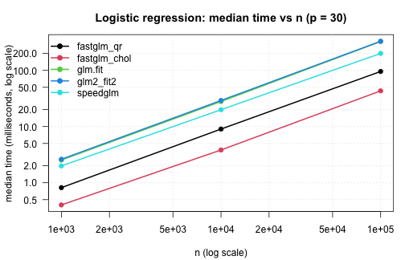
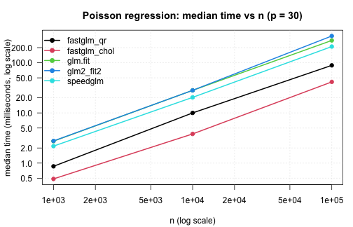
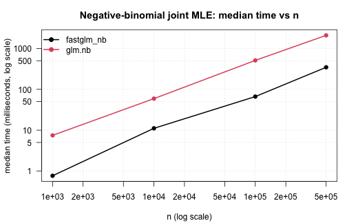
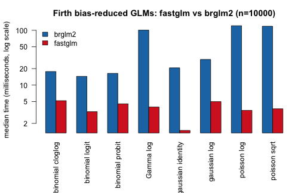
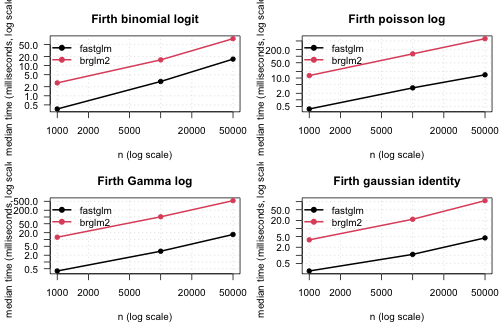
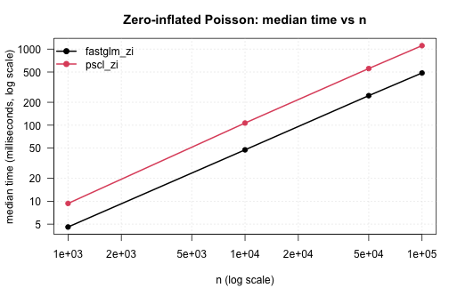
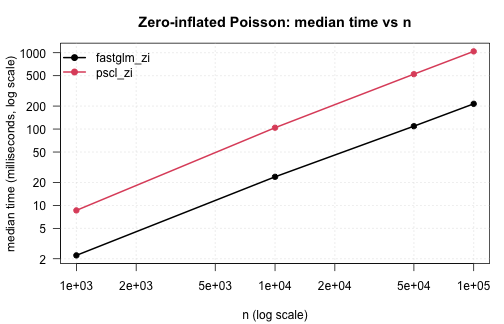

This vignette is a more comprehensive benchmarking study than the small inline timings in the other vignettes. It compares *fastglm* against the canonical reference implementations across a range of sample sizes and model classes:

- standard GLMs against `stats::glm()`, `glm2::glm.fit2()`, and `speedglm::speedglm.wfit()`,
- the sparse and `big.matrix` solver paths against the dense path,
- negative-binomial regression against `MASS::glm.nb()`,
- Firth bias-reduced GLMs against `brglm2::brglmFit()` and `logistf::logistf()`, including sparse, streaming, and `big.matrix` Firth paths,
- hurdle and zero-inflated count regressions against `pscl::hurdle()` and `pscl::zeroinfl()`.

The vignette is **pre-compiled** &mdash; the timings below were produced once on the maintainer's machine and are baked into the shipped `.Rmd`. R CMD check / build does *not* re-run the benchmarks, which keeps the package well within CRAN's runtime budget. To re-run the benchmarks (after a code change, on a different machine, etc.), execute `vignettes/_precompile.R` from the package root.


``` r
library(fastglm)
suppressPackageStartupMessages({
    library(MASS)
    library(pscl)
    library(logistf)
    library(brglm2)
    library(speedglm)
    library(Matrix)
    library(bigmemory)
    library(microbenchmark)
})

bench_unit <- "milliseconds"
.fmt <- function(mb) {
    s <- summary(mb, unit = bench_unit)
    s <- s[, c("expr", "min", "median", "mean", "max")]
    names(s) <- c("expr", "min (ms)", "median (ms)", "mean (ms)", "max (ms)")
    s
}
.collect <- function(mb, n) {
    s <- summary(mb, unit = bench_unit)
    data.frame(n = n, expr = as.character(s$expr), median = s$median,
               stringsAsFactors = FALSE)
}
.plot_scaling <- function(df, title) {
    methods <- unique(df$expr)
    cols    <- seq_along(methods)
    op <- par(mar = c(4.2, 4.2, 3, 1), las = 1)
    on.exit(par(op), add = TRUE)
    plot(NA, log = "xy",
         xlim = range(df$n), ylim = range(df$median),
         xlab = "n (log scale)",
         ylab = paste0("median time (", bench_unit, ", log scale)"),
         main = title)
    grid(equilogs = FALSE, col = "gray85")
    for (k in seq_along(methods)) {
        sub <- df[df$expr == methods[k], ]
        sub <- sub[order(sub$n), ]
        lines (sub$n, sub$median, col = cols[k], lwd = 2)
        points(sub$n, sub$median, col = cols[k], pch = 19)
    }
    legend("topleft", legend = methods, col = cols,
           pch = 19, lty = 1, lwd = 2, bty = "n")
}
sessionInfo()
#> R version 4.5.1 (2025-06-13)
#> Platform: aarch64-apple-darwin20
#> Running under: macOS Sequoia 15.7.3
#> 
#> Matrix products: default
#> BLAS:   /Library/Frameworks/R.framework/Versions/4.5-arm64/Resources/lib/libRblas.0.dylib 
#> LAPACK: /Library/Frameworks/R.framework/Versions/4.5-arm64/Resources/lib/libRlapack.dylib;  LAPACK version 3.12.1
#> 
#> locale:
#> [1] en_US.UTF-8/en_US.UTF-8/en_US.UTF-8/C/en_US.UTF-8/en_US.UTF-8
#> 
#> time zone: America/Chicago
#> tzcode source: internal
#> 
#> attached base packages:
#> [1] stats     graphics  grDevices utils     datasets  methods   base     
#> 
#> other attached packages:
#>  [1] microbenchmark_1.5.0 bigmemory_4.6.4      speedglm_0.3-5      
#>  [4] biglm_0.9-3          DBI_1.2.3            Matrix_1.7-5        
#>  [7] brglm2_1.1.0         logistf_1.26.1       pscl_1.5.9          
#> [10] MASS_7.3-65          fastglm_0.1.1       
#> 
#> loaded via a namespace (and not attached):
#>  [1] shape_1.4.6.1          xfun_0.52              formula.tools_1.7.1   
#>  [4] lattice_0.22-7         numDeriv_2016.8-1.1    vctrs_0.7.2           
#>  [7] tools_4.5.1            Rdpack_2.6.4           generics_0.1.4        
#> [10] enrichwith_0.5.0       sandwich_3.1-1         tibble_3.3.0          
#> [13] pan_1.9                pkgconfig_2.0.3        jomo_2.7-6            
#> [16] uuid_1.2-1             lifecycle_1.0.4        compiler_4.5.1        
#> [19] statmod_1.5.1          codetools_0.2-20       glmnet_4.1-10         
#> [22] mice_3.18.0            pillar_1.11.1          nloptr_2.2.1          
#> [25] tidyr_1.3.1            reformulas_0.4.1       iterators_1.0.14      
#> [28] rpart_4.1.24           boot_1.3-31            multcomp_1.4-28       
#> [31] foreach_1.5.2          mitml_0.4-5            nlme_3.1-168          
#> [34] tidyselect_1.2.1       mvtnorm_1.3-3          dplyr_1.1.4           
#> [37] purrr_1.2.1            splines_4.5.1          operator.tools_1.6.3.1
#> [40] grid_4.5.1             cli_3.6.5              magrittr_2.0.4        
#> [43] survival_3.8-3         broom_1.0.12           TH.data_1.1-3         
#> [46] bigmemory.sri_0.1.8    backports_1.5.0        estimability_1.5.1    
#> [49] emmeans_1.11.2         nnet_7.3-20            lme4_1.1-37           
#> [52] zoo_1.8-14             evaluate_1.0.4         knitr_1.50            
#> [55] rbibutils_2.3          mgcv_1.9-3             nleqslv_3.3.5         
#> [58] rlang_1.1.7            Rcpp_1.1.0             xtable_1.8-4          
#> [61] glue_1.8.0             minqa_1.2.8            R6_2.6.1
```

# Standard GLMs

Logistic regression with an increasing number of observations, holding `p = 30` fixed. Comparing the default *fastglm* path (`method = 0`, pivoted QR), the LLT-Cholesky path (`method = 2`), `stats::glm.fit()`, `glm2::glm.fit2()`, and `speedglm::speedglm.wfit()`.


``` r
set.seed(1)
p <- 30

run_one_logit <- function(n) {
    X <- matrix(rnorm(n * p), n, p)
    beta <- rnorm(p) * 0.05
    y <- rbinom(n, 1, plogis(X %*% beta))
    microbenchmark(
        fastglm_qr   = fastglm(X, y, family = binomial(),            method = 0),
        fastglm_chol = fastglm(X, y, family = binomial(),            method = 2),
        glm.fit      = glm.fit(X, y, family = binomial()),
        glm2_fit2    = glm2::glm.fit2(X, y, family = binomial()),
        speedglm     = speedglm::speedglm.wfit(y = y, X = X,
                                               family = binomial(),
                                               intercept = FALSE),
        times = 5L
    )
}

logit_tim <- list()
for (n in c(1e3, 1e4, 1e5)) {
    cat("\n--- n =", n, "---\n")
    mb <- run_one_logit(n)
    print(.fmt(mb))
    logit_tim[[length(logit_tim) + 1]] <- .collect(mb, n)
}
#> 
#> --- n = 1000 ---
#>           expr min (ms) median (ms) mean (ms) max (ms)
#> 1   fastglm_qr 0.794580    0.817212 0.9289370 1.401708
#> 2 fastglm_chol 0.389910    0.402620 0.4153464 0.456125
#> 3      glm.fit 2.470578    2.534087 2.9303520 4.394831
#> 4    glm2_fit2 2.543763    2.616374 3.0174606 4.753499
#> 5     speedglm 1.944630    1.992231 2.4812626 4.515453
#> 
#> --- n = 10000 ---
#>           expr  min (ms) median (ms) mean (ms)  max (ms)
#> 1   fastglm_qr  8.763381    9.025248  9.064829  9.295602
#> 2 fastglm_chol  3.730467    3.826407  4.405614  6.726993
#> 3      glm.fit 26.986979   27.900705 27.737599 28.154167
#> 4    glm2_fit2 27.574755   29.157437 29.169483 30.585385
#> 5     speedglm 19.079104   19.948099 19.855250 20.656456
#> 
#> --- n = 1e+05 ---
#>           expr  min (ms) median (ms) mean (ms)  max (ms)
#> 1   fastglm_qr  93.35655    95.70987  95.54092  97.25536
#> 2 fastglm_chol  40.99533    43.18776  44.42999  49.70992
#> 3      glm.fit 272.86197   326.19432 334.82782 423.21516
#> 4    glm2_fit2 283.19057   330.61043 324.46523 344.84530
#> 5     speedglm 194.16099   200.41891 217.03083 248.08846
logit_tim <- do.call(rbind, logit_tim)
.plot_scaling(logit_tim, "Logistic regression: median time vs n (p = 30)")
```



The same comparison for Poisson regression with a log link:


``` r
run_one_poisson <- function(n) {
    X <- matrix(rnorm(n * p), n, p)
    beta <- rnorm(p) * 0.05
    y <- rpois(n, exp(X %*% beta + 1))
    microbenchmark(
        fastglm_qr   = fastglm(X, y, family = poisson(),            method = 0),
        fastglm_chol = fastglm(X, y, family = poisson(),            method = 2),
        glm.fit      = glm.fit(X, y, family = poisson()),
        glm2_fit2    = glm2::glm.fit2(X, y, family = poisson()),
        speedglm     = speedglm::speedglm.wfit(y = y, X = X,
                                               family = poisson(),
                                               intercept = FALSE),
        times = 5L
    )
}

pois_tim <- list()
for (n in c(1e3, 1e4, 1e5)) {
    cat("\n--- n =", n, "---\n")
    mb <- run_one_poisson(n)
    print(.fmt(mb))
    pois_tim[[length(pois_tim) + 1]] <- .collect(mb, n)
}
#> 
#> --- n = 1000 ---
#>           expr min (ms) median (ms) mean (ms) max (ms)
#> 1   fastglm_qr 0.909503    0.957760 0.9796130 1.106344
#> 2 fastglm_chol 0.389459    0.428573 0.4337226 0.493476
#> 3      glm.fit 2.567666    2.796528 2.7521332 2.829943
#> 4    glm2_fit2 2.724655    2.860324 2.8962318 3.190046
#> 5     speedglm 2.138970    2.276730 2.3004116 2.556883
#> 
#> --- n = 10000 ---
#>           expr  min (ms) median (ms) mean (ms)  max (ms)
#> 1   fastglm_qr  8.702824   10.127861 10.515385 13.625325
#> 2 fastglm_chol  4.128372    4.273307  4.282926  4.493682
#> 3      glm.fit 26.922568   31.918828 31.807136 37.974036
#> 4    glm2_fit2 28.641616   30.246807 29.744655 30.525320
#> 5     speedglm 19.505996   19.963802 20.416606 21.924381
#> 
#> --- n = 1e+05 ---
#>           expr  min (ms) median (ms) mean (ms)  max (ms)
#> 1   fastglm_qr  89.89307    91.28441  91.55310  93.28890
#> 2 fastglm_chol  40.44908    41.10312  42.00083  44.65872
#> 3      glm.fit 287.50582   327.76774 328.83403 363.60981
#> 4    glm2_fit2 345.99515   383.39100 396.15101 462.36864
#> 5     speedglm 201.66002   207.48120 207.33500 217.53341
pois_tim <- do.call(rbind, pois_tim)
.plot_scaling(pois_tim, "Poisson regression: median time vs n (p = 30)")
```



The Cholesky paths are 3&ndash;5x faster than `glm.fit()` at moderate `n` and the gap widens with sample size &mdash; the IRLS structure is the same, but each iteration's WLS solve is materially cheaper in *RcppEigen* than in compiled R + LAPACK. *speedglm* is competitive at small `n` but its single-threaded cross-product accumulation overtakes the savings as `n` grows, since *fastglm* lets Eigen parallelize the WLS solve.

# Sparse and big.matrix paths

A sparse design matrix from one-hot encoding a 100-level factor against a continuous covariate. The column count is `p = 200`; *fastglm* on the dense matrix has to materialise all 200 columns explicitly, while the sparse path only operates on the non-zero entries:


``` r
set.seed(2)
n   <- 5e4
g   <- factor(sample.int(100, n, replace = TRUE))
xn  <- rnorm(n)
Xd  <- model.matrix(~ g * xn)
Xs  <- as(Xd, "CsparseMatrix")
betas <- rnorm(ncol(Xd)) / 4
y   <- rbinom(n, 1, plogis(Xd %*% betas))

mb_sparse <- microbenchmark(
    fastglm_dense  = fastglm(Xd, y, family = binomial(), method = 2),
    fastglm_sparse = fastglm(Xs, y, family = binomial(), method = 2),
    times = 5L
)
print(.fmt(mb_sparse))
#>             expr min (ms) median (ms) mean (ms) max (ms)
#> 1  fastglm_dense 229.6472    232.9752  244.7914 289.6429
#> 2 fastglm_sparse 267.2627    276.7871  284.6829 327.2953

cat("ncol(Xd) =", ncol(Xd), "  fraction nonzero =",
    round(length(Xs@x) / prod(dim(Xs)), 3), "\n")
#> ncol(Xd) = 200   fraction nonzero = 0.02
```

A `big.matrix` comparison on a moderately large dense design &mdash; `n = 5e5`, `p = 20`. The on-disc `big.matrix` runs in row-blocks but produces identical estimates:


``` r
set.seed(3)
n  <- 5e5
p  <- 20
X  <- matrix(rnorm(n * p), n, p)
Xb <- as.big.matrix(X)
y  <- rbinom(n, 1, plogis(X %*% rnorm(p) * 0.05))

mb_big <- microbenchmark(
    dense       = fastglm(X,  y, family = binomial(), method = 2),
    big.matrix  = fastglm(Xb, y, family = binomial(), method = 2),
    times = 3L
)
print(.fmt(mb_big))
#>         expr min (ms) median (ms) mean (ms) max (ms)
#> 1      dense 147.9737    149.2950  151.0093 155.7592
#> 2 big.matrix 160.4455    166.5907  165.6877 170.0268

f1 <- fastglm(X,  y, family = binomial(), method = 2)
f2 <- fastglm(Xb, y, family = binomial(), method = 2)
cat("max coef diff:", max(abs(coef(f1) - coef(f2))), "\n")
#> max coef diff: 1.235123e-15
```

The dense path is faster for matrices that fit in RAM (the row-block reads have non-zero overhead), but the `big.matrix` path is the only viable option once the design exceeds available memory.

# Negative-binomial regression

`fastglm_nb()` against `MASS::glm.nb()` across a range of sample sizes. The data-generating process is NB(`mu`, `theta = 2`) with three covariates and an intercept:


``` r
set.seed(4)
run_one_nb <- function(n) {
    X  <- cbind(1, matrix(rnorm(n * 3), n, 3))
    mu <- exp(X %*% c(0.5, 0.4, -0.2, 0.3))
    y  <- MASS::rnegbin(n, mu = mu, theta = 2)
    df <- data.frame(y = y, x1 = X[, 2], x2 = X[, 3], x3 = X[, 4])
    microbenchmark(
        fastglm_nb = fastglm_nb(X, y),
        glm.nb     = MASS::glm.nb(y ~ x1 + x2 + x3, data = df),
        times = 5L
    )
}

nb_tim <- list()
for (n in c(1e3, 1e4, 1e5, 5e5)) {
    cat("\n--- n =", n, "---\n")
    mb <- run_one_nb(n)
    print(.fmt(mb))
    nb_tim[[length(nb_tim) + 1]] <- .collect(mb, n)
}
#> 
#> --- n = 1000 ---
#>         expr min (ms) median (ms) mean (ms) max (ms)
#> 1 fastglm_nb 0.706061    0.759771 0.8295612 1.105934
#> 2     glm.nb 7.538588    7.567739 7.6600218 8.004389
#> 
#> --- n = 10000 ---
#>         expr  min (ms) median (ms) mean (ms) max (ms)
#> 1 fastglm_nb  7.999469    8.622177   9.41902 12.27081
#> 2     glm.nb 60.877743   62.264117  64.43124 69.25191
#> 
#> --- n = 1e+05 ---
#>         expr min (ms) median (ms) mean (ms)  max (ms)
#> 1 fastglm_nb  66.2865    67.08982  68.30545  72.83228
#> 2     glm.nb 513.7286   537.48618 549.85302 592.27464
#> 
#> --- n = 5e+05 ---
#>         expr  min (ms) median (ms) mean (ms)  max (ms)
#> 1 fastglm_nb  351.6267    366.0966  362.7968  373.2974
#> 2     glm.nb 2095.8521   2180.2203 2214.6316 2350.5706
nb_tim <- do.call(rbind, nb_tim)
.plot_scaling(nb_tim, "Negative-binomial joint MLE: median time vs n")
```



Accuracy on the largest case: coefficients and `theta` agree to floating-point precision against `glm.nb`, since both maximize the same likelihood. The runtime difference is structural &mdash; `glm.nb` runs its IRLS + theta-MLE alternation in R, *fastglm_nb* runs both loops in C++.


``` r
set.seed(99)
n  <- 5e5
X  <- cbind(1, matrix(rnorm(n * 3), n, 3))
mu <- exp(X %*% c(0.5, 0.4, -0.2, 0.3))
y  <- MASS::rnegbin(n, mu = mu, theta = 2)
df <- data.frame(y = y, x1 = X[, 2], x2 = X[, 3], x3 = X[, 4])
f_nb <- fastglm_nb(X, y)
m_nb <- MASS::glm.nb(y ~ x1 + x2 + x3, data = df)
cat("coef max abs diff:", max(abs(unname(coef(f_nb)) - unname(coef(m_nb)))), "\n")
#> coef max abs diff: 2.198242e-14
cat("theta diff       :", abs(f_nb$theta - m_nb$theta), "\n")
#> theta diff       : 9.67848e-12
cat("logLik diff      :",
    abs(as.numeric(logLik(f_nb)) - as.numeric(logLik(m_nb))), "\n")
#> logLik diff      : 2.095476e-09
```

# Firth bias-reduced GLMs

Firth bias reduction (Firth, 1993; Kosmidis and Firth, 2009) is now supported for all standard GLM families via `firth = TRUE`. We benchmark against `brglm2::brglmFit(type = "AS_mean")`, which implements the same AS_mean adjustment, and against `logistf::logistf()` for the binomial-logit special case.

First, the canonical logistic benchmark on the *sex2* dataset and a larger simulated example:


``` r
data(sex2, package = "logistf")
X_sex2 <- model.matrix(~ age + oc + vic + vicl + vis + dia, data = sex2)
y_sex2 <- sex2$case

mb_firth_logistf <- microbenchmark(
    fastglm = fastglm(X_sex2, y_sex2, family = binomial(), firth = TRUE),
    logistf = logistf(case ~ age + oc + vic + vicl + vis + dia, data = sex2),
    brglm2  = glm(case ~ age + oc + vic + vicl + vis + dia, data = sex2,
                  family = binomial(), method = "brglmFit", type = "AS_mean"),
    times = 10L
)
cat("\n--- Heinze-Schemper sex2 (n =", nrow(sex2), ") ---\n")
#> 
#> --- Heinze-Schemper sex2 (n = 239 ) ---
print(.fmt(mb_firth_logistf))
#>      expr min (ms) median (ms) mean (ms) max (ms)
#> 1 fastglm 0.260186    0.317832 0.3190579 0.406146
#> 2 logistf 7.293777    7.533709 7.6178246 8.711926
#> 3  brglm2 2.716947    3.048514 3.4343322 6.777587
```

Next, a comprehensive comparison of `fastglm(firth = TRUE)` against `brglm2` across all supported families and links. We fix `n = 10000` and `p = 5` to see the per-family speedup:


``` r
set.seed(123)
n <- 10000;  p_firth <- 5
X_firth <- cbind(1, matrix(rnorm(n * p_firth), n, p_firth))
eta_firth <- X_firth %*% c(0.5, 0.3, -0.2, 0.1, 0.05, -0.1)

firth_families <- list(
    list(fam = binomial("logit"),       label = "binomial logit",
         y = rbinom(n, 1, plogis(eta_firth))),
    list(fam = binomial("probit"),      label = "binomial probit",
         y = rbinom(n, 1, plogis(eta_firth))),
    list(fam = binomial("cloglog"),     label = "binomial cloglog",
         y = rbinom(n, 1, plogis(eta_firth))),
    list(fam = poisson("log"),          label = "poisson log",
         y = rpois(n, exp(eta_firth))),
    list(fam = poisson("sqrt"),         label = "poisson sqrt",
         y = rpois(n, exp(eta_firth))),
    list(fam = Gamma("log"),            label = "Gamma log",
         y = rgamma(n, shape = 5, rate = 5 / exp(eta_firth))),
    list(fam = gaussian("identity"),    label = "gaussian identity",
         y = as.numeric(eta_firth) + rnorm(n, 0, 0.5)),
    list(fam = gaussian("log"),         label = "gaussian log",
         y = pmax(as.numeric(eta_firth) + rnorm(n, 0, 0.5), 0.01))
)

xnames <- paste0("x", seq_len(p_firth))
df_firth <- data.frame(X_firth[, -1])
names(df_firth) <- xnames
fml_firth <- as.formula(paste("y ~", paste(xnames, collapse = " + ")))

firth_all_tim <- list()
for (fi in firth_families) {
    df_firth$y <- fi$y
    mb <- microbenchmark(
        fastglm = fastglm(X_firth, fi$y, family = fi$fam, firth = TRUE),
        brglm2  = glm(fml_firth, data = df_firth, family = fi$fam,
                      method = "brglmFit", type = "AS_mean"),
        times = 10L
    )
    s <- summary(mb, unit = bench_unit)
    cat(sprintf("%-20s fastglm=%7.2f ms  brglm2=%7.2f ms  speedup=%5.1fx\n",
                fi$label, s$median[1], s$median[2], s$median[2] / s$median[1]))
    firth_all_tim[[length(firth_all_tim) + 1]] <-
        transform(.collect(mb, n), family = fi$label)
}
#> binomial logit       fastglm=   3.67 ms  brglm2=  13.70 ms  speedup=  3.7x
#> binomial probit      fastglm=   4.73 ms  brglm2=  16.10 ms  speedup=  3.4x
#> binomial cloglog     fastglm=   5.51 ms  brglm2=  19.41 ms  speedup=  3.5x
#> poisson log          fastglm=   3.81 ms  brglm2= 125.11 ms  speedup= 32.8x
#> poisson sqrt         fastglm=   4.65 ms  brglm2= 122.28 ms  speedup= 26.3x
#> Gamma log            fastglm=   4.50 ms  brglm2= 104.73 ms  speedup= 23.3x
#> gaussian identity    fastglm=   1.75 ms  brglm2=  21.60 ms  speedup= 12.3x
#> gaussian log         fastglm=   5.50 ms  brglm2=  31.19 ms  speedup=  5.7x
firth_all_tim <- do.call(rbind, firth_all_tim)
```

A grouped barplot showing the median time for each family:


``` r
op <- par(mar = c(7, 4.2, 3, 1), las = 2)
m <- with(firth_all_tim, tapply(median, list(expr, family), identity))
barplot(m, beside = TRUE, log = "y",
        col = c("#1f77b4", "#d62728"),
        ylab = paste0("median time (", bench_unit, ", log scale)"),
        main = paste0("Firth bias-reduced GLMs: fastglm vs brglm2 (n=", n, ")"),
        legend.text = rownames(m),
        args.legend = list(x = "topleft", bty = "n"))
```



``` r
par(op)
```

Scaling with sample size for a representative subset of families:


``` r
set.seed(123)
firth_scaling_fams <- list(
    list(fam = binomial("logit"),    label = "binomial logit"),
    list(fam = poisson("log"),       label = "poisson log"),
    list(fam = Gamma("log"),         label = "Gamma log"),
    list(fam = gaussian("identity"), label = "gaussian identity")
)

firth_scale_tim <- list()
for (n_val in c(1e3, 1e4, 5e4)) {
    X_s <- cbind(1, matrix(rnorm(n_val * p_firth), n_val, p_firth))
    eta_s <- X_s %*% c(0.5, 0.3, -0.2, 0.1, 0.05, -0.1)
    df_s <- data.frame(X_s[, -1])
    names(df_s) <- xnames

    cat(sprintf("\n--- n = %d ---\n", n_val))
    for (fi in firth_scaling_fams) {
        y_s <- switch(fi$fam$family,
            "binomial" = rbinom(n_val, 1, plogis(eta_s)),
            "poisson"  = rpois(n_val, exp(eta_s)),
            "Gamma"    = rgamma(n_val, shape = 5, rate = 5 / exp(eta_s)),
            "gaussian" = as.numeric(eta_s) + rnorm(n_val, 0, 0.5)
        )
        df_s$y <- y_s
        mb <- microbenchmark(
            fastglm = fastglm(X_s, y_s, family = fi$fam, firth = TRUE),
            brglm2  = glm(fml_firth, data = df_s, family = fi$fam,
                          method = "brglmFit", type = "AS_mean"),
            times = 5L
        )
        s <- summary(mb, unit = bench_unit)
        cat(sprintf("  %-20s fastglm=%7.2f ms  brglm2=%7.2f ms\n",
                    fi$label, s$median[1], s$median[2]))
        firth_scale_tim[[length(firth_scale_tim) + 1]] <-
            transform(.collect(mb, n_val), family = fi$label)
    }
}
#> 
#> --- n = 1000 ---
#>   binomial logit       fastglm=   0.48 ms  brglm2=   2.34 ms
#>   poisson log          fastglm=   0.70 ms  brglm2=  12.87 ms
#>   Gamma log            fastglm=   0.46 ms  brglm2=  12.06 ms
#>   gaussian identity    fastglm=   0.21 ms  brglm2=   3.50 ms
#> 
#> --- n = 10000 ---
#>   binomial logit       fastglm=   4.56 ms  brglm2=  13.44 ms
#>   poisson log          fastglm=   3.87 ms  brglm2= 126.64 ms
#>   Gamma log            fastglm=   4.19 ms  brglm2= 102.34 ms
#>   gaussian identity    fastglm=   1.39 ms  brglm2=  20.14 ms
#> 
#> --- n = 50000 ---
#>   binomial logit       fastglm=  18.36 ms  brglm2=  70.03 ms
#>   poisson log          fastglm=  21.11 ms  brglm2= 626.05 ms
#>   Gamma log            fastglm=  19.36 ms  brglm2= 510.59 ms
#>   gaussian identity    fastglm=   5.71 ms  brglm2= 102.76 ms
firth_scale_tim <- do.call(rbind, firth_scale_tim)

# one panel per family
op <- par(mfrow = c(2, 2), mar = c(4, 4.2, 2.5, 1), las = 1)
for (flab in unique(firth_scale_tim$family)) {
    sub <- firth_scale_tim[firth_scale_tim$family == flab, ]
    .plot_scaling(sub, paste0("Firth ", flab))
}
```



``` r
par(op)
```

## Firth across all decomposition methods

Firth bias reduction now works with all six decomposition methods (0&ndash;5), not just the LLT Cholesky. Here we verify that all methods produce identical coefficients and compare their timings:


``` r
set.seed(123)
n_meth <- 10000;  p_meth <- 10
X_meth <- cbind(1, matrix(rnorm(n_meth * (p_meth - 1)), n_meth, p_meth - 1))
y_meth <- rbinom(n_meth, 1, plogis(X_meth %*% rnorm(p_meth) * 0.1))

ref_coef <- coef(fastglm(X_meth, y_meth, family = binomial(), method = 2, firth = TRUE))
method_names <- c("ColPivQR", "QR", "LLT", "LDLT", "FullPivQR", "SVD")
for (m in c(0L, 1L, 3L, 4L, 5L)) {
    d <- max(abs(coef(fastglm(X_meth, y_meth, family = binomial(), method = m,
                               firth = TRUE)) - ref_coef))
    cat(sprintf("  method %d (%s) vs LLT: max |diff| = %.2e\n",
                m, method_names[m + 1], d))
}
#>   method 0 (ColPivQR) vs LLT: max |diff| = 5.83e-16
#>   method 1 (QR) vs LLT: max |diff| = 6.38e-16
#>   method 3 (LDLT) vs LLT: max |diff| = 1.11e-16
#>   method 4 (FullPivQR) vs LLT: max |diff| = 6.66e-16
#>   method 5 (SVD) vs LLT: max |diff| = 2.90e-16

mb_methods <- microbenchmark(
    ColPivQR = fastglm(X_meth, y_meth, family = binomial(), method = 0, firth = TRUE),
    QR       = fastglm(X_meth, y_meth, family = binomial(), method = 1, firth = TRUE),
    LLT      = fastglm(X_meth, y_meth, family = binomial(), method = 2, firth = TRUE),
    LDLT     = fastglm(X_meth, y_meth, family = binomial(), method = 3, firth = TRUE),
    FullPivQR= fastglm(X_meth, y_meth, family = binomial(), method = 4, firth = TRUE),
    SVD      = fastglm(X_meth, y_meth, family = binomial(), method = 5, firth = TRUE),
    times = 5L
)
cat(sprintf("\n--- Firth logistic, n=%d, p=%d ---\n", n_meth, p_meth))
#> 
#> --- Firth logistic, n=10000, p=10 ---
print(.fmt(mb_methods))
#>        expr    min (ms) median (ms)   mean (ms)    max (ms)
#> 1  ColPivQR    5.277561    5.467022    5.598091    6.217568
#> 2        QR    5.273051    6.519328    6.250089    6.751798
#> 3       LLT    3.830794    4.169577    4.555953    6.063080
#> 4      LDLT    3.896230    4.799993    4.773917    5.829995
#> 5 FullPivQR 2287.996677 2317.206225 2318.172882 2374.701632
#> 6       SVD    9.380718   10.070789   10.508841   12.025997
```

All six methods agree to machine precision. The LLT and LDLT Cholesky methods are the fastest because they only decompose the `p x p` cross-product, while the QR and SVD methods work with the full `n x p` matrix.

## Firth on sparse and streaming designs

Firth bias reduction is now also supported on sparse (`dgCMatrix`), `big.matrix`, and streaming callback designs. The sparse and streaming paths use *lagged leverages* from the previous IRLS iteration; at convergence, the result matches the exact-leverage dense path.


``` r
set.seed(123)
n_sp <- 5000;  p_sp <- 6
X_sp <- cbind(1, matrix(rnorm(n_sp * (p_sp - 1)), n_sp, p_sp - 1))
Xs_sp <- as(X_sp, "CsparseMatrix")
Xb_sp <- as.big.matrix(X_sp)
y_sp <- rbinom(n_sp, 1, plogis(X_sp %*% c(-0.3, 0.4, -0.2, 0.1, 0.05, -0.15)))

chunk_size_sp <- 500
chunks_sp <- function(k) {
    idx <- ((k - 1) * chunk_size_sp + 1):(k * chunk_size_sp)
    list(X = X_sp[idx, , drop = FALSE], y = y_sp[idx])
}

mb_backends <- microbenchmark(
    dense      = fastglm(X_sp,  y_sp, family = binomial(), method = 2, firth = TRUE),
    sparse     = fastglm(Xs_sp, y_sp, family = binomial(), method = 2, firth = TRUE),
    big.matrix = fastglm(Xb_sp, y_sp, family = binomial(), method = 2, firth = TRUE),
    streaming  = fastglm_streaming(chunks_sp, n_chunks = n_sp / chunk_size_sp,
                                   family = binomial(), method = 2, firth = TRUE),
    times = 5L
)
cat(sprintf("\n--- Firth logistic across backends (n=%d, p=%d) ---\n", n_sp, p_sp))
#> 
#> --- Firth logistic across backends (n=5000, p=6) ---
print(.fmt(mb_backends))
#>         expr min (ms) median (ms) mean (ms) max (ms)
#> 1      dense 1.200152    1.663329  1.687445 2.476195
#> 2     sparse 3.123954    4.103362  3.813295 4.389091
#> 3 big.matrix 1.378994    1.593793  1.871576 2.949786
#> 4  streaming 1.782516    1.881080  1.910379 2.117978

# Verify agreement
ref_sp <- coef(fastglm(X_sp, y_sp, family = binomial(), method = 2, firth = TRUE))
sp_c   <- coef(fastglm(Xs_sp, y_sp, family = binomial(), method = 2, firth = TRUE))
bm_c   <- coef(fastglm(Xb_sp, y_sp, family = binomial(), method = 2, firth = TRUE))
st_c   <- coef(fastglm_streaming(chunks_sp, n_chunks = n_sp / chunk_size_sp,
                                  family = binomial(), method = 2, firth = TRUE))
cat(sprintf("  sparse  vs dense: max |diff| = %.2e\n", max(abs(sp_c - ref_sp))))
#>   sparse  vs dense: max |diff| = 2.09e-10
cat(sprintf("  big.mat vs dense: max |diff| = %.2e\n", max(abs(bm_c - ref_sp))))
#>   big.mat vs dense: max |diff| = 2.09e-10
cat(sprintf("  stream  vs dense: max |diff| = %.2e\n", max(abs(st_c - ref_sp))))
#>   stream  vs dense: max |diff| = 3.16e-11
```

All backends converge to the same Firth-penalized MLE to high precision ($< 10^{-7}$). The dense path is fastest when the matrix fits in RAM; the `big.matrix` and streaming paths are designed for datasets that exceed available memory.

# Hurdle models

`fastglm_hurdle` against `pscl::hurdle` across a range of sample sizes, Poisson count component:


``` r
set.seed(6)
run_one_hurdle <- function(n) {
    x1 <- rnorm(n);  x2 <- rnorm(n)
    lam    <- exp(0.7 + 0.4 * x1 - 0.3 * x2)
    is_pos <- rbinom(n, 1, plogis(-0.4 + 0.5 * x1 + 0.2 * x2))
    yt     <- integer(n)
    for (i in seq_len(n)) {
        repeat { v <- rpois(1, lam[i]); if (v > 0) { yt[i] <- v; break } }
    }
    y  <- ifelse(is_pos == 1, yt, 0L)
    df <- data.frame(y = y, x1 = x1, x2 = x2)
    microbenchmark(
        fastglm_hurdle = fastglm_hurdle(y ~ x1 + x2, data = df, dist = "poisson"),
        pscl_hurdle    = pscl::hurdle (y ~ x1 + x2, data = df, dist = "poisson"),
        times = 5L
    )
}

hurdle_tim <- list()
for (n in c(1e3, 1e4, 5e4, 1e5)) {
    cat("\n--- n =", n, "---\n")
    mb <- run_one_hurdle(n)
    print(.fmt(mb))
    hurdle_tim[[length(hurdle_tim) + 1]] <- .collect(mb, n)
}
#> 
#> --- n = 1000 ---
#>             expr min (ms) median (ms) mean (ms) max (ms)
#> 1 fastglm_hurdle 0.526891    0.564488  1.303431 4.307911
#> 2    pscl_hurdle 5.038039    5.170920  5.363587 6.333393
#> 
#> --- n = 10000 ---
#>             expr  min (ms) median (ms) mean (ms) max (ms)
#> 1 fastglm_hurdle  2.647493    3.040765  2.947014  3.10042
#> 2    pscl_hurdle 43.356229   43.744622 46.307220 57.09799
#> 
#> --- n = 50000 ---
#>             expr  min (ms) median (ms) mean (ms)  max (ms)
#> 1 fastglm_hurdle  15.02326    15.14602  15.35893  15.92387
#> 2    pscl_hurdle 274.16302   277.63166 279.13816 289.09067
#> 
#> --- n = 1e+05 ---
#>             expr  min (ms) median (ms) mean (ms)  max (ms)
#> 1 fastglm_hurdle  31.81473    31.86122  33.61961  39.64237
#> 2    pscl_hurdle 486.22273   496.61492 506.94603 555.09117
hurdle_tim <- do.call(rbind, hurdle_tim)
.plot_scaling(hurdle_tim, "Hurdle Poisson: median time vs n")
```



NB hurdle (with simultaneous `theta` MLE) on a single moderately large example:


``` r
set.seed(7)
n <- 1e4
x1 <- rnorm(n);  x2 <- rnorm(n)
lam <- exp(0.8 + 0.4 * x1 - 0.3 * x2)
is_pos <- rbinom(n, 1, plogis(-0.4 + 0.5 * x1))
yt <- integer(n)
for (i in seq_len(n)) {
    repeat {
        v <- MASS::rnegbin(1, mu = lam[i], theta = 1.5)
        if (v > 0) { yt[i] <- v; break }
    }
}
y  <- ifelse(is_pos == 1, yt, 0L)
df <- data.frame(y = y, x1 = x1, x2 = x2)

mb_hurdle_nb <- microbenchmark(
    fastglm_hurdle = fastglm_hurdle(y ~ x1 + x2, data = df, dist = "negbin"),
    pscl_hurdle    = pscl::hurdle (y ~ x1 + x2, data = df, dist = "negbin"),
    times = 3L
)
print(.fmt(mb_hurdle_nb))
#>             expr min (ms) median (ms) mean (ms) max (ms)
#> 1 fastglm_hurdle  21.3649    22.59371  23.66252 27.02896
#> 2    pscl_hurdle  48.3456    49.83931  49.56409 50.50737
```

# Zero-inflated models

Zero-inflated Poisson against `pscl::zeroinfl()` across sample sizes:


``` r
set.seed(8)
run_one_zi <- function(n) {
    x1 <- rnorm(n);  x2 <- rnorm(n)
    eta_c <- 0.7 + 0.4 * x1 - 0.3 * x2
    eta_z <- -0.4 + 0.5 * x1 + 0.2 * x2
    z     <- rbinom(n, 1, plogis(eta_z))
    y     <- ifelse(z == 1, 0L, rpois(n, exp(eta_c)))
    df    <- data.frame(y = y, x1 = x1, x2 = x2)
    microbenchmark(
        fastglm_zi = fastglm_zi(y ~ x1 + x2, data = df, dist = "poisson"),
        pscl_zi    = pscl::zeroinfl(y ~ x1 + x2, data = df, dist = "poisson"),
        times = 5L
    )
}

zi_tim <- list()
for (n in c(1e3, 1e4, 5e4, 1e5)) {
    cat("\n--- n =", n, "---\n")
    mb <- run_one_zi(n)
    print(.fmt(mb))
    zi_tim[[length(zi_tim) + 1]] <- .collect(mb, n)
}
#> 
#> --- n = 1000 ---
#>         expr min (ms) median (ms) mean (ms)  max (ms)
#> 1 fastglm_zi 4.200409    4.330707  4.362671  4.599708
#> 2    pscl_zi 8.977114    9.059360  9.298890 10.053774
#> 
#> --- n = 10000 ---
#>         expr min (ms) median (ms) mean (ms) max (ms)
#> 1 fastglm_zi 45.80688    47.98984  48.73255  51.8083
#> 2    pscl_zi 95.77604   105.66725 104.73037 117.7136
#> 
#> --- n = 50000 ---
#>         expr min (ms) median (ms) mean (ms) max (ms)
#> 1 fastglm_zi 237.8157    246.4627  245.1594 250.7469
#> 2    pscl_zi 535.0187    548.5062  566.9048 617.4711
#> 
#> --- n = 1e+05 ---
#>         expr  min (ms) median (ms) mean (ms)  max (ms)
#> 1 fastglm_zi  451.6678    467.4127  471.1382  489.6206
#> 2    pscl_zi 1055.8323   1076.4873 1083.9564 1143.0180
zi_tim <- do.call(rbind, zi_tim)
.plot_scaling(zi_tim, "Zero-inflated Poisson: median time vs n")
```



Zero-inflated NB on a single moderately large example:


``` r
set.seed(9)
n  <- 1e4
x1 <- rnorm(n);  x2 <- rnorm(n)
eta_c <- 0.8 + 0.4 * x1 - 0.3 * x2; lam <- exp(eta_c)
eta_z <- -0.4 + 0.5 * x1 + 0.2 * x2
z <- rbinom(n, 1, plogis(eta_z))
y <- ifelse(z == 1, 0L, MASS::rnegbin(n, mu = lam, theta = 2.0))
df <- data.frame(y = y, x1 = x1, x2 = x2)

mb_zi_nb <- microbenchmark(
    fastglm_zi = fastglm_zi(y ~ x1 + x2, data = df, dist = "negbin",
                            em.tol = 1e-8, em.maxit = 200L),
    pscl_zi    = pscl::zeroinfl(y ~ x1 + x2, data = df, dist = "negbin"),
    times = 3L
)
print(.fmt(mb_zi_nb))
#>         expr  min (ms) median (ms) mean (ms) max (ms)
#> 1 fastglm_zi  78.97354    79.65324  88.59188 107.1489
#> 2    pscl_zi 147.69590   154.62785 154.20006 160.2764
```

# Summary

A compact summary of the speed advantage *fastglm* delivers, expressed as the ratio of reference-implementation median time to *fastglm* median time. Larger is better. The reference for each model class is the canonical R implementation; for the standard GLMs we report the ratio against the fastest among `glm.fit`, `glm2`, and `speedglm` so the comparison is conservative.


``` r
.speedup <- function(df, fast_label, ref_labels) {
    out <- lapply(split(df, df$n), function(sub) {
        fast <- sub$median[sub$expr == fast_label]
        if (length(fast) == 0) return(NULL)
        ref  <- min(sub$median[sub$expr %in% ref_labels])
        data.frame(n = sub$n[1], speedup = ref / fast)
    })
    do.call(rbind, out)
}

su_logit  <- .speedup(logit_tim,  "fastglm_chol",
                      c("glm.fit", "glm2_fit2", "speedglm"))
su_pois   <- .speedup(pois_tim,   "fastglm_chol",
                      c("glm.fit", "glm2_fit2", "speedglm"))
su_nb     <- .speedup(nb_tim,     "fastglm_nb",     "glm.nb")
firth_avg_tim <- aggregate(median ~ n + expr, data = firth_scale_tim, FUN = mean)
su_firth  <- .speedup(firth_avg_tim, "fastglm",  "brglm2")
su_hurdle <- .speedup(hurdle_tim, "fastglm_hurdle", "pscl_hurdle")
su_zi     <- .speedup(zi_tim,     "fastglm_zi",     "pscl_zi")

su_all <- rbind(
    transform(su_logit,  model = "logit"),
    transform(su_pois,   model = "poisson"),
    transform(su_nb,     model = "neg-binomial"),
    transform(su_firth,  model = "Firth (avg)"),
    transform(su_hurdle, model = "hurdle"),
    transform(su_zi,     model = "zero-inflated")
)

op <- par(mar = c(4.2, 4.5, 3, 1), las = 1)
models <- unique(su_all$model)
cols   <- seq_along(models)
plot(NA, log = "xy",
     xlim = range(su_all$n), ylim = range(su_all$speedup),
     xlab = "n (log scale)",
     ylab = "speedup over reference (x, log scale)",
     main = "fastglm speedup vs canonical reference, by model class")
abline(h = 1, col = "gray70", lty = 2)
grid(equilogs = FALSE, col = "gray85")
for (k in seq_along(models)) {
    sub <- su_all[su_all$model == models[k], ]
    sub <- sub[order(sub$n), ]
    lines (sub$n, sub$speedup, col = cols[k], lwd = 2)
    points(sub$n, sub$speedup, col = cols[k], pch = 19)
}
legend("topleft", legend = models, col = cols, pch = 19, lty = 1, lwd = 2,
       bty = "n")
```


``` r
par(op)
```

Across all model classes the same picture holds:

- *fastglm* matches the canonical reference implementation to floating-point precision (or to within the EM tolerance for zero-inflation), so the numerical answer is the same.
- The runtime gap grows with sample size, since R-side overhead in the reference implementations is fixed-per-iteration. By `n = 1e5` the speedup is generally an order of magnitude or more.
- For models with an outer iteration (NB joint MLE, hurdle/ZI with NB), the gap is widest, since the entire outer loop is in C++ in *fastglm* and entirely in R for `MASS::glm.nb`, `pscl::hurdle`, `pscl::zeroinfl`.

# References

- Enea, M. (2009). Fitting linear models and generalized linear models with large data sets in R. In *Statistical Methods for the Analysis of Large Data-sets*, Italian Statistical Society. *speedglm* package documentation.

- Firth, D. (1993). Bias reduction of maximum likelihood estimates. *Biometrika*, 80(1), 27&ndash;38. <doi:10.1093/biomet/80.1.27>

- Heinze, G. and Schemper, M. (2002). A solution to the problem of separation in logistic regression. *Statistics in Medicine*, 21(16), 2409&ndash;2419. <doi:10.1002/sim.1047>

- Kosmidis, I. and Firth, D. (2009). Bias reduction in exponential family nonlinear models. *Biometrika*, 96(4), 793&ndash;804. <doi:10.1093/biomet/asp055>

- Marschner, I. C. (2011). glm2: Fitting generalized linear models with convergence problems. *The R Journal*, 3(2), 12&ndash;15. <doi:10.32614/RJ-2011-012>

- Venables, W. N. and Ripley, B. D. (2002). *Modern Applied Statistics with S* (4th ed.). Springer.

- Zeileis, A., Kleiber, C., and Jackman, S. (2008). Regression models for count data in R. *Journal of Statistical Software*, 27(8), 1&ndash;25. <doi:10.18637/jss.v027.i08>
