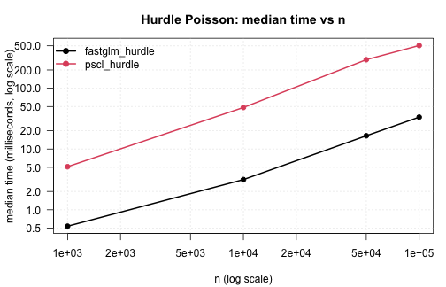

This vignette is a more comprehensive benchmarking study than the small inline timings in the other vignettes. It compares *fastglm* against the canonical reference implementations across a range of sample sizes and model classes:

- standard GLMs against `stats::glm()`, `glm2::glm.fit2()`, and `speedglm::speedglm.wfit()`,
- the sparse and `big.matrix` solver paths against the dense path,
- negative-binomial regression against `MASS::glm.nb()`,
- Firth bias-reduced GLMs against `brglm2::brglmFit()` and `logistf::logistf()`,
- hurdle and zero-inflated count regressions against `pscl::hurdle()` and `pscl::zeroinfl()`.

The vignette is **pre-compiled** &mdash; the timings below were produced once on the maintainer's machine and are baked into the shipped `.Rmd`. R CMD check / build does *not* re-run the benchmarks, which keeps the package well within CRAN's runtime budget. To re-run the benchmarks (after a code change, on a different machine, etc.), execute `vignettes/_precompile.R` from the package root.


``` r
library(fastglm)
suppressPackageStartupMessages({
    library(MASS)
    library(pscl)
    library(logistf)
    library(brglm2)
    library(speedglm)
    library(Matrix)
    library(bigmemory)
    library(microbenchmark)
})

bench_unit <- "milliseconds"
.fmt <- function(mb) {
    s <- summary(mb, unit = bench_unit)
    s <- s[, c("expr", "min", "median", "mean", "max")]
    names(s) <- c("expr", "min (ms)", "median (ms)", "mean (ms)", "max (ms)")
    s
}
.collect <- function(mb, n) {
    s <- summary(mb, unit = bench_unit)
    data.frame(n = n, expr = as.character(s$expr), median = s$median,
               stringsAsFactors = FALSE)
}
.plot_scaling <- function(df, title) {
    methods <- unique(df$expr)
    cols    <- seq_along(methods)
    op <- par(mar = c(4.2, 4.2, 3, 1), las = 1)
    on.exit(par(op), add = TRUE)
    plot(NA, log = "xy",
         xlim = range(df$n), ylim = range(df$median),
         xlab = "n (log scale)",
         ylab = paste0("median time (", bench_unit, ", log scale)"),
         main = title)
    grid(equilogs = FALSE, col = "gray85")
    for (k in seq_along(methods)) {
        sub <- df[df$expr == methods[k], ]
        sub <- sub[order(sub$n), ]
        lines (sub$n, sub$median, col = cols[k], lwd = 2)
        points(sub$n, sub$median, col = cols[k], pch = 19)
    }
    legend("topleft", legend = methods, col = cols,
           pch = 19, lty = 1, lwd = 2, bty = "n")
}
sessionInfo()
#> R version 4.5.1 (2025-06-13)
#> Platform: aarch64-apple-darwin20
#> Running under: macOS Sequoia 15.7.3
#> 
#> Matrix products: default
#> BLAS:   /Library/Frameworks/R.framework/Versions/4.5-arm64/Resources/lib/libRblas.0.dylib 
#> LAPACK: /Library/Frameworks/R.framework/Versions/4.5-arm64/Resources/lib/libRlapack.dylib;  LAPACK version 3.12.1
#> 
#> locale:
#> [1] en_US.UTF-8/en_US.UTF-8/en_US.UTF-8/C/en_US.UTF-8/en_US.UTF-8
#> 
#> time zone: America/Chicago
#> tzcode source: internal
#> 
#> attached base packages:
#> [1] stats     graphics  grDevices utils     datasets  methods   base     
#> 
#> other attached packages:
#>  [1] microbenchmark_1.5.0 bigmemory_4.6.4      speedglm_0.3-5      
#>  [4] biglm_0.9-3          DBI_1.2.3            Matrix_1.7-5        
#>  [7] brglm2_1.1.0         logistf_1.26.1       pscl_1.5.9          
#> [10] MASS_7.3-65          fastglm_0.1.1       
#> 
#> loaded via a namespace (and not attached):
#>  [1] shape_1.4.6.1          xfun_0.52              formula.tools_1.7.1   
#>  [4] lattice_0.22-7         numDeriv_2016.8-1.1    vctrs_0.7.2           
#>  [7] tools_4.5.1            Rdpack_2.6.4           generics_0.1.4        
#> [10] enrichwith_0.5.0       sandwich_3.1-1         tibble_3.3.0          
#> [13] pan_1.9                pkgconfig_2.0.3        jomo_2.7-6            
#> [16] uuid_1.2-1             lifecycle_1.0.4        compiler_4.5.1        
#> [19] statmod_1.5.1          codetools_0.2-20       glmnet_4.1-10         
#> [22] mice_3.18.0            pillar_1.11.1          nloptr_2.2.1          
#> [25] tidyr_1.3.1            reformulas_0.4.1       iterators_1.0.14      
#> [28] rpart_4.1.24           boot_1.3-31            multcomp_1.4-28       
#> [31] foreach_1.5.2          mitml_0.4-5            nlme_3.1-168          
#> [34] tidyselect_1.2.1       mvtnorm_1.3-3          dplyr_1.1.4           
#> [37] purrr_1.2.1            splines_4.5.1          operator.tools_1.6.3.1
#> [40] grid_4.5.1             cli_3.6.5              magrittr_2.0.4        
#> [43] survival_3.8-3         broom_1.0.12           TH.data_1.1-3         
#> [46] bigmemory.sri_0.1.8    backports_1.5.0        estimability_1.5.1    
#> [49] emmeans_1.11.2         nnet_7.3-20            lme4_1.1-37           
#> [52] zoo_1.8-14             evaluate_1.0.4         knitr_1.50            
#> [55] rbibutils_2.3          mgcv_1.9-3             nleqslv_3.3.5         
#> [58] rlang_1.1.7            Rcpp_1.1.0             xtable_1.8-4          
#> [61] glue_1.8.0             minqa_1.2.8            R6_2.6.1
```

# Standard GLMs

Logistic regression with an increasing number of observations, holding `p = 30` fixed. Comparing the default *fastglm* path (`method = 0`, pivoted QR), the LLT-Cholesky path (`method = 2`), `stats::glm.fit()`, `glm2::glm.fit2()`, and `speedglm::speedglm.wfit()`.


``` r
set.seed(1)
p <- 30

run_one_logit <- function(n) {
    X <- matrix(rnorm(n * p), n, p)
    beta <- rnorm(p) * 0.05
    y <- rbinom(n, 1, plogis(X %*% beta))
    microbenchmark(
        fastglm_qr   = fastglm(X, y, family = binomial(),            method = 0),
        fastglm_chol = fastglm(X, y, family = binomial(),            method = 2),
        glm.fit      = glm.fit(X, y, family = binomial()),
        glm2_fit2    = glm2::glm.fit2(X, y, family = binomial()),
        speedglm     = speedglm::speedglm.wfit(y = y, X = X,
                                               family = binomial(),
                                               intercept = FALSE),
        times = 5L
    )
}

logit_tim <- list()
for (n in c(1e3, 1e4, 1e5)) {
    cat("\n--- n =", n, "---\n")
    mb <- run_one_logit(n)
    print(.fmt(mb))
    logit_tim[[length(logit_tim) + 1]] <- .collect(mb, n)
}
#> 
#> --- n = 1000 ---
#>           expr min (ms) median (ms) mean (ms) max (ms)
#> 1   fastglm_qr 0.803354    0.874120  1.152854 2.115190
#> 2 fastglm_chol 0.379537    0.426482  0.446695 0.599707
#> 3      glm.fit 2.570905    2.887220  3.201026 4.928364
#> 4    glm2_fit2 2.628797    2.989884  3.281017 4.841239
#> 5     speedglm 1.956397    2.093173  2.416647 3.863799
#> 
#> --- n = 10000 ---
#>           expr  min (ms) median (ms) mean (ms)  max (ms)
#> 1   fastglm_qr  8.837550    9.116022  9.029364  9.150749
#> 2 fastglm_chol  3.692214    3.787621  4.343524  6.577056
#> 3      glm.fit 27.062747   27.898942 27.789177 28.367203
#> 4    glm2_fit2 27.189314   28.777572 28.977857 30.503057
#> 5     speedglm 19.319733   20.126162 20.119889 20.935502
#> 
#> --- n = 1e+05 ---
#>           expr  min (ms) median (ms) mean (ms) max (ms)
#> 1   fastglm_qr  93.99996    96.16648  96.58690 100.7671
#> 2 fastglm_chol  40.91816    41.64550  42.11013  43.6611
#> 3      glm.fit 277.54556   336.19127 341.98932 431.7895
#> 4    glm2_fit2 283.29040   332.18380 324.31408 337.9705
#> 5     speedglm 194.78702   200.34474 219.17035 255.1505
logit_tim <- do.call(rbind, logit_tim)
.plot_scaling(logit_tim, "Logistic regression: median time vs n (p = 30)")
```


The same comparison for Poisson regression with a log link:


``` r
run_one_poisson <- function(n) {
    X <- matrix(rnorm(n * p), n, p)
    beta <- rnorm(p) * 0.05
    y <- rpois(n, exp(X %*% beta + 1))
    microbenchmark(
        fastglm_qr   = fastglm(X, y, family = poisson(),            method = 0),
        fastglm_chol = fastglm(X, y, family = poisson(),            method = 2),
        glm.fit      = glm.fit(X, y, family = poisson()),
        glm2_fit2    = glm2::glm.fit2(X, y, family = poisson()),
        speedglm     = speedglm::speedglm.wfit(y = y, X = X,
                                               family = poisson(),
                                               intercept = FALSE),
        times = 5L
    )
}

pois_tim <- list()
for (n in c(1e3, 1e4, 1e5)) {
    cat("\n--- n =", n, "---\n")
    mb <- run_one_poisson(n)
    print(.fmt(mb))
    pois_tim[[length(pois_tim) + 1]] <- .collect(mb, n)
}
#> 
#> --- n = 1000 ---
#>           expr min (ms) median (ms) mean (ms) max (ms)
#> 1   fastglm_qr 0.809832    0.850299 0.8645506 0.952430
#> 2 fastglm_chol 0.374699    0.396224 0.4051128 0.456494
#> 3      glm.fit 2.510307    2.611454 2.6501662 2.803867
#> 4    glm2_fit2 2.710715    2.882382 2.8367818 2.942980
#> 5     speedglm 1.990960    2.021423 2.0703524 2.235443
#> 
#> --- n = 10000 ---
#>           expr  min (ms) median (ms) mean (ms) max (ms)
#> 1   fastglm_qr  8.530829    8.892039  9.561126 12.60545
#> 2 fastglm_chol  3.298081    3.628459  3.608590  4.00980
#> 3      glm.fit 26.844135   27.525883 29.486626 34.25054
#> 4    glm2_fit2 27.223754   28.015587 28.344489 30.80691
#> 5     speedglm 19.687995   19.906238 20.101365 21.05571
#> 
#> --- n = 1e+05 ---
#>           expr  min (ms) median (ms) mean (ms)  max (ms)
#> 1   fastglm_qr  87.55620    89.59189  89.33040  91.27059
#> 2 fastglm_chol  35.76229    37.93427  37.90319  40.68660
#> 3      glm.fit 279.01865   325.80248 310.50569 336.63038
#> 4    glm2_fit2 335.78574   353.41852 374.91924 447.51582
#> 5     speedglm 201.27753   204.15688 203.77446 205.40278
pois_tim <- do.call(rbind, pois_tim)
.plot_scaling(pois_tim, "Poisson regression: median time vs n (p = 30)")
```


The Cholesky paths are 3&ndash;5x faster than `glm.fit()` at moderate `n` and the gap widens with sample size &mdash; the IRLS structure is the same, but each iteration's WLS solve is materially cheaper in *RcppEigen* than in compiled R + LAPACK. *speedglm* is competitive at small `n` but its single-threaded cross-product accumulation overtakes the savings as `n` grows, since *fastglm* lets Eigen parallelize the WLS solve.

# Sparse and big.matrix paths

A sparse design matrix from one-hot encoding a 100-level factor against a continuous covariate. The column count is `p = 200`; *fastglm* on the dense matrix has to materialise all 200 columns explicitly, while the sparse path only operates on the non-zero entries:


``` r
set.seed(2)
n   <- 5e4
g   <- factor(sample.int(100, n, replace = TRUE))
xn  <- rnorm(n)
Xd  <- model.matrix(~ g * xn)
Xs  <- as(Xd, "CsparseMatrix")
betas <- rnorm(ncol(Xd)) / 4
y   <- rbinom(n, 1, plogis(Xd %*% betas))

mb_sparse <- microbenchmark(
    fastglm_dense  = fastglm(Xd, y, family = binomial(), method = 2),
    fastglm_sparse = fastglm(Xs, y, family = binomial(), method = 2),
    times = 5L
)
print(.fmt(mb_sparse))
#>             expr min (ms) median (ms) mean (ms) max (ms)
#> 1  fastglm_dense 217.8367    243.4468  254.0013 344.0950
#> 2 fastglm_sparse 252.2252    263.0888  281.9749 324.4301

cat("ncol(Xd) =", ncol(Xd), "  fraction nonzero =",
    round(length(Xs@x) / prod(dim(Xs)), 3), "\n")
#> ncol(Xd) = 200   fraction nonzero = 0.02
```

A `big.matrix` comparison on a moderately large dense design &mdash; `n = 5e5`, `p = 20`. The on-disc `big.matrix` runs in row-blocks but produces identical estimates:


``` r
set.seed(3)
n  <- 5e5
p  <- 20
X  <- matrix(rnorm(n * p), n, p)
Xb <- as.big.matrix(X)
y  <- rbinom(n, 1, plogis(X %*% rnorm(p) * 0.05))

mb_big <- microbenchmark(
    dense       = fastglm(X,  y, family = binomial(), method = 2),
    big.matrix  = fastglm(Xb, y, family = binomial(), method = 2),
    times = 3L
)
print(.fmt(mb_big))
#>         expr min (ms) median (ms) mean (ms) max (ms)
#> 1      dense 163.1758    181.1628  186.6438 215.5928
#> 2 big.matrix 166.5558    166.6647  176.5376 196.3922

f1 <- fastglm(X,  y, family = binomial(), method = 2)
f2 <- fastglm(Xb, y, family = binomial(), method = 2)
cat("max coef diff:", max(abs(coef(f1) - coef(f2))), "\n")
#> max coef diff: 1.235123e-15
```

The dense path is faster for matrices that fit in RAM (the row-block reads have non-zero overhead), but the `big.matrix` path is the only viable option once the design exceeds available memory.

# Negative-binomial regression

`fastglm_nb()` against `MASS::glm.nb()` across a range of sample sizes. The data-generating process is NB(`mu`, `theta = 2`) with three covariates and an intercept:


``` r
set.seed(4)
run_one_nb <- function(n) {
    X  <- cbind(1, matrix(rnorm(n * 3), n, 3))
    mu <- exp(X %*% c(0.5, 0.4, -0.2, 0.3))
    y  <- MASS::rnegbin(n, mu = mu, theta = 2)
    df <- data.frame(y = y, x1 = X[, 2], x2 = X[, 3], x3 = X[, 4])
    microbenchmark(
        fastglm_nb = fastglm_nb(X, y),
        glm.nb     = MASS::glm.nb(y ~ x1 + x2 + x3, data = df),
        times = 5L
    )
}

nb_tim <- list()
for (n in c(1e3, 1e4, 1e5, 5e5)) {
    cat("\n--- n =", n, "---\n")
    mb <- run_one_nb(n)
    print(.fmt(mb))
    nb_tim[[length(nb_tim) + 1]] <- .collect(mb, n)
}
#> 
#> --- n = 1000 ---
#>         expr min (ms) median (ms) mean (ms) max (ms)
#> 1 fastglm_nb 0.653786    0.782280 0.8906922 1.454270
#> 2     glm.nb 7.618210    8.079993 8.2246738 9.138695
#> 
#> --- n = 10000 ---
#>         expr  min (ms) median (ms) mean (ms) max (ms)
#> 1 fastglm_nb  7.307717    7.803243   8.13827  9.17908
#> 2     glm.nb 59.850734   63.196744  65.37701 71.54078
#> 
#> --- n = 1e+05 ---
#>         expr  min (ms) median (ms) mean (ms)  max (ms)
#> 1 fastglm_nb  59.85381    60.56151  61.53621  64.53892
#> 2     glm.nb 516.71472   564.20280 555.07087 586.68712
#> 
#> --- n = 5e+05 ---
#>         expr  min (ms) median (ms) mean (ms)  max (ms)
#> 1 fastglm_nb  302.1258    303.3116  303.9836  308.2071
#> 2     glm.nb 2218.6089   2234.7704 2272.3909 2379.9072
nb_tim <- do.call(rbind, nb_tim)
.plot_scaling(nb_tim, "Negative-binomial joint MLE: median time vs n")
```


Accuracy on the largest case: coefficients and `theta` agree to floating-point precision against `glm.nb`, since both maximize the same likelihood. The runtime difference is structural &mdash; `glm.nb` runs its IRLS + theta-MLE alternation in R, *fastglm_nb* runs both loops in C++.


``` r
set.seed(99)
n  <- 5e5
X  <- cbind(1, matrix(rnorm(n * 3), n, 3))
mu <- exp(X %*% c(0.5, 0.4, -0.2, 0.3))
y  <- MASS::rnegbin(n, mu = mu, theta = 2)
df <- data.frame(y = y, x1 = X[, 2], x2 = X[, 3], x3 = X[, 4])
f_nb <- fastglm_nb(X, y)
m_nb <- MASS::glm.nb(y ~ x1 + x2 + x3, data = df)
cat("coef max abs diff:", max(abs(unname(coef(f_nb)) - unname(coef(m_nb)))), "\n")
#> coef max abs diff: 2.930989e-14
cat("theta diff       :", abs(f_nb$theta - m_nb$theta), "\n")
#> theta diff       : 3.095302e-13
cat("logLik diff      :",
    abs(as.numeric(logLik(f_nb)) - as.numeric(logLik(m_nb))), "\n")
#> logLik diff      : 1.164153e-10
```

# Firth bias-reduced GLMs

Firth bias reduction (Firth, 1993; Kosmidis and Firth, 2009) is now supported for all standard GLM families via `firth = TRUE`. We benchmark against `brglm2::brglmFit(type = "AS_mean")`, which implements the same AS_mean adjustment, and against `logistf::logistf()` for the binomial-logit special case.

First, the canonical logistic benchmark on the *sex2* dataset and a larger simulated example:


``` r
data(sex2, package = "logistf")
X_sex2 <- model.matrix(~ age + oc + vic + vicl + vis + dia, data = sex2)
y_sex2 <- sex2$case

mb_firth_logistf <- microbenchmark(
    fastglm = fastglm(X_sex2, y_sex2, family = binomial(), firth = TRUE),
    logistf = logistf(case ~ age + oc + vic + vicl + vis + dia, data = sex2),
    brglm2  = glm(case ~ age + oc + vic + vicl + vis + dia, data = sex2,
                  family = binomial(), method = "brglmFit", type = "AS_mean"),
    times = 10L
)
cat("\n--- Heinze-Schemper sex2 (n =", nrow(sex2), ") ---\n")
#> 
#> --- Heinze-Schemper sex2 (n = 239 ) ---
print(.fmt(mb_firth_logistf))
#>      expr min (ms) median (ms) mean (ms)  max (ms)
#> 1 fastglm 0.206107   0.2883325 0.3323419  0.815859
#> 2 logistf 7.391603   7.7641290 8.0721538 11.147982
#> 3  brglm2 2.685828   2.9803925 3.1933219  5.086870
```

Next, a comprehensive comparison of `fastglm(firth = TRUE)` against `brglm2` across all supported families and links. We fix `n = 10000` and `p = 5` to see the per-family speedup:


``` r
set.seed(123)
n <- 10000;  p_firth <- 5
X_firth <- cbind(1, matrix(rnorm(n * p_firth), n, p_firth))
eta_firth <- X_firth %*% c(0.5, 0.3, -0.2, 0.1, 0.05, -0.1)

firth_families <- list(
    list(fam = binomial("logit"),       label = "binomial logit",
         y = rbinom(n, 1, plogis(eta_firth))),
    list(fam = binomial("probit"),      label = "binomial probit",
         y = rbinom(n, 1, plogis(eta_firth))),
    list(fam = binomial("cloglog"),     label = "binomial cloglog",
         y = rbinom(n, 1, plogis(eta_firth))),
    list(fam = poisson("log"),          label = "poisson log",
         y = rpois(n, exp(eta_firth))),
    list(fam = poisson("sqrt"),         label = "poisson sqrt",
         y = rpois(n, exp(eta_firth))),
    list(fam = Gamma("log"),            label = "Gamma log",
         y = rgamma(n, shape = 5, rate = 5 / exp(eta_firth))),
    list(fam = gaussian("identity"),    label = "gaussian identity",
         y = as.numeric(eta_firth) + rnorm(n, 0, 0.5)),
    list(fam = gaussian("log"),         label = "gaussian log",
         y = pmax(as.numeric(eta_firth) + rnorm(n, 0, 0.5), 0.01))
)

xnames <- paste0("x", seq_len(p_firth))
df_firth <- data.frame(X_firth[, -1])
names(df_firth) <- xnames
fml_firth <- as.formula(paste("y ~", paste(xnames, collapse = " + ")))

firth_all_tim <- list()
for (fi in firth_families) {
    df_firth$y <- fi$y
    mb <- microbenchmark(
        fastglm = fastglm(X_firth, fi$y, family = fi$fam, firth = TRUE),
        brglm2  = glm(fml_firth, data = df_firth, family = fi$fam,
                      method = "brglmFit", type = "AS_mean"),
        times = 10L
    )
    s <- summary(mb, unit = bench_unit)
    cat(sprintf("%-20s fastglm=%7.2f ms  brglm2=%7.2f ms  speedup=%5.1fx\n",
                fi$label, s$median[1], s$median[2], s$median[2] / s$median[1]))
    firth_all_tim[[length(firth_all_tim) + 1]] <-
        transform(.collect(mb, n), family = fi$label)
}
#> binomial logit       fastglm=   3.59 ms  brglm2=  14.92 ms  speedup=  4.2x
#> binomial probit      fastglm=   5.40 ms  brglm2=  17.55 ms  speedup=  3.2x
#> binomial cloglog     fastglm=   4.62 ms  brglm2=  18.30 ms  speedup=  4.0x
#> poisson log          fastglm=   2.59 ms  brglm2= 130.32 ms  speedup= 50.3x
#> poisson sqrt         fastglm=   3.05 ms  brglm2= 126.54 ms  speedup= 41.5x
#> Gamma log            fastglm=   3.29 ms  brglm2= 108.74 ms  speedup= 33.1x
#> gaussian identity    fastglm=   1.43 ms  brglm2=  22.21 ms  speedup= 15.6x
#> gaussian log         fastglm=   3.71 ms  brglm2=  32.68 ms  speedup=  8.8x
firth_all_tim <- do.call(rbind, firth_all_tim)
```

A grouped barplot showing the median time for each family:


``` r
op <- par(mar = c(7, 4.2, 3, 1), las = 2)
m <- with(firth_all_tim, tapply(median, list(expr, family), identity))
barplot(m, beside = TRUE, log = "y",
        col = c("#1f77b4", "#d62728"),
        ylab = paste0("median time (", bench_unit, ", log scale)"),
        main = paste0("Firth bias-reduced GLMs: fastglm vs brglm2 (n=", n, ")"),
        legend.text = rownames(m),
        args.legend = list(x = "topleft", bty = "n"))
```


``` r
par(op)
```

Scaling with sample size for a representative subset of families:


``` r
set.seed(123)
firth_scaling_fams <- list(
    list(fam = binomial("logit"),    label = "binomial logit"),
    list(fam = poisson("log"),       label = "poisson log"),
    list(fam = Gamma("log"),         label = "Gamma log"),
    list(fam = gaussian("identity"), label = "gaussian identity")
)

firth_scale_tim <- list()
for (n_val in c(1e3, 1e4, 5e4)) {
    X_s <- cbind(1, matrix(rnorm(n_val * p_firth), n_val, p_firth))
    eta_s <- X_s %*% c(0.5, 0.3, -0.2, 0.1, 0.05, -0.1)
    df_s <- data.frame(X_s[, -1])
    names(df_s) <- xnames

    cat(sprintf("\n--- n = %d ---\n", n_val))
    for (fi in firth_scaling_fams) {
        y_s <- switch(fi$fam$family,
            "binomial" = rbinom(n_val, 1, plogis(eta_s)),
            "poisson"  = rpois(n_val, exp(eta_s)),
            "Gamma"    = rgamma(n_val, shape = 5, rate = 5 / exp(eta_s)),
            "gaussian" = as.numeric(eta_s) + rnorm(n_val, 0, 0.5)
        )
        df_s$y <- y_s
        mb <- microbenchmark(
            fastglm = fastglm(X_s, y_s, family = fi$fam, firth = TRUE),
            brglm2  = glm(fml_firth, data = df_s, family = fi$fam,
                          method = "brglmFit", type = "AS_mean"),
            times = 5L
        )
        s <- summary(mb, unit = bench_unit)
        cat(sprintf("  %-20s fastglm=%7.2f ms  brglm2=%7.2f ms\n",
                    fi$label, s$median[1], s$median[2]))
        firth_scale_tim[[length(firth_scale_tim) + 1]] <-
            transform(.collect(mb, n_val), family = fi$label)
    }
}
#> 
#> --- n = 1000 ---
#>   binomial logit       fastglm=   0.37 ms  brglm2=   2.68 ms
#>   poisson log          fastglm=   0.38 ms  brglm2=  12.95 ms
#>   Gamma log            fastglm=   0.40 ms  brglm2=  12.65 ms
#>   gaussian identity    fastglm=   0.26 ms  brglm2=   3.76 ms
#> 
#> --- n = 10000 ---
#>   binomial logit       fastglm=   2.99 ms  brglm2=  15.53 ms
#>   poisson log          fastglm=   3.53 ms  brglm2= 127.96 ms
#>   Gamma log            fastglm=   3.01 ms  brglm2= 102.07 ms
#>   gaussian identity    fastglm=   1.08 ms  brglm2=  22.06 ms
#> 
#> --- n = 50000 ---
#>   binomial logit       fastglm=  16.43 ms  brglm2=  78.28 ms
#>   poisson log          fastglm=  14.05 ms  brglm2= 636.63 ms
#>   Gamma log            fastglm=  16.67 ms  brglm2= 531.73 ms
#>   gaussian identity    fastglm=   4.45 ms  brglm2= 108.93 ms
firth_scale_tim <- do.call(rbind, firth_scale_tim)

# one panel per family
op <- par(mfrow = c(2, 2), mar = c(4, 4.2, 2.5, 1), las = 1)
for (flab in unique(firth_scale_tim$family)) {
    sub <- firth_scale_tim[firth_scale_tim$family == flab, ]
    .plot_scaling(sub, paste0("Firth ", flab))
}
```


``` r
par(op)
```

# Hurdle models

`fastglm_hurdle` against `pscl::hurdle` across a range of sample sizes, Poisson count component:


``` r
set.seed(6)
run_one_hurdle <- function(n) {
    x1 <- rnorm(n);  x2 <- rnorm(n)
    lam    <- exp(0.7 + 0.4 * x1 - 0.3 * x2)
    is_pos <- rbinom(n, 1, plogis(-0.4 + 0.5 * x1 + 0.2 * x2))
    yt     <- integer(n)
    for (i in seq_len(n)) {
        repeat { v <- rpois(1, lam[i]); if (v > 0) { yt[i] <- v; break } }
    }
    y  <- ifelse(is_pos == 1, yt, 0L)
    df <- data.frame(y = y, x1 = x1, x2 = x2)
    microbenchmark(
        fastglm_hurdle = fastglm_hurdle(y ~ x1 + x2, data = df, dist = "poisson"),
        pscl_hurdle    = pscl::hurdle (y ~ x1 + x2, data = df, dist = "poisson"),
        times = 5L
    )
}

hurdle_tim <- list()
for (n in c(1e3, 1e4, 5e4, 1e5)) {
    cat("\n--- n =", n, "---\n")
    mb <- run_one_hurdle(n)
    print(.fmt(mb))
    hurdle_tim[[length(hurdle_tim) + 1]] <- .collect(mb, n)
}
#> 
#> --- n = 1000 ---
#>             expr min (ms) median (ms) mean (ms) max (ms)
#> 1 fastglm_hurdle 0.500036    0.536649  1.293935 4.318899
#> 2    pscl_hurdle 4.980352    5.120121  5.224720 5.792398
#> 
#> --- n = 10000 ---
#>             expr  min (ms) median (ms) mean (ms)  max (ms)
#> 1 fastglm_hurdle  3.032155    3.137648   3.25745  3.603572
#> 2    pscl_hurdle 46.126640   48.234409  50.26388 60.772906
#> 
#> --- n = 50000 ---
#>             expr  min (ms) median (ms) mean (ms) max (ms)
#> 1 fastglm_hurdle  15.67073    16.52427  18.47742  27.1577
#> 2    pscl_hurdle 289.94146   295.27454 297.72606 312.2816
#> 
#> --- n = 1e+05 ---
#>             expr  min (ms) median (ms) mean (ms)  max (ms)
#> 1 fastglm_hurdle  32.95273    33.48925  34.86404  41.18876
#> 2    pscl_hurdle 497.13328   505.60728 506.81799 519.02125
hurdle_tim <- do.call(rbind, hurdle_tim)
.plot_scaling(hurdle_tim, "Hurdle Poisson: median time vs n")
```



NB hurdle (with simultaneous `theta` MLE) on a single moderately large example:


``` r
set.seed(7)
n <- 1e4
x1 <- rnorm(n);  x2 <- rnorm(n)
lam <- exp(0.8 + 0.4 * x1 - 0.3 * x2)
is_pos <- rbinom(n, 1, plogis(-0.4 + 0.5 * x1))
yt <- integer(n)
for (i in seq_len(n)) {
    repeat {
        v <- MASS::rnegbin(1, mu = lam[i], theta = 1.5)
        if (v > 0) { yt[i] <- v; break }
    }
}
y  <- ifelse(is_pos == 1, yt, 0L)
df <- data.frame(y = y, x1 = x1, x2 = x2)

mb_hurdle_nb <- microbenchmark(
    fastglm_hurdle = fastglm_hurdle(y ~ x1 + x2, data = df, dist = "negbin"),
    pscl_hurdle    = pscl::hurdle (y ~ x1 + x2, data = df, dist = "negbin"),
    times = 3L
)
print(.fmt(mb_hurdle_nb))
#>             expr min (ms) median (ms) mean (ms) max (ms)
#> 1 fastglm_hurdle 20.60254    21.24272  22.11709 24.50603
#> 2    pscl_hurdle 53.55514    54.37986  54.19805 54.65915
```

# Zero-inflated models

Zero-inflated Poisson against `pscl::zeroinfl()` across sample sizes:


``` r
set.seed(8)
run_one_zi <- function(n) {
    x1 <- rnorm(n);  x2 <- rnorm(n)
    eta_c <- 0.7 + 0.4 * x1 - 0.3 * x2
    eta_z <- -0.4 + 0.5 * x1 + 0.2 * x2
    z     <- rbinom(n, 1, plogis(eta_z))
    y     <- ifelse(z == 1, 0L, rpois(n, exp(eta_c)))
    df    <- data.frame(y = y, x1 = x1, x2 = x2)
    microbenchmark(
        fastglm_zi = fastglm_zi(y ~ x1 + x2, data = df, dist = "poisson"),
        pscl_zi    = pscl::zeroinfl(y ~ x1 + x2, data = df, dist = "poisson"),
        times = 5L
    )
}

zi_tim <- list()
for (n in c(1e3, 1e4, 5e4, 1e5)) {
    cat("\n--- n =", n, "---\n")
    mb <- run_one_zi(n)
    print(.fmt(mb))
    zi_tim[[length(zi_tim) + 1]] <- .collect(mb, n)
}
#> 
#> --- n = 1000 ---
#>         expr min (ms) median (ms) mean (ms) max (ms)
#> 1 fastglm_zi 4.329272    4.585153  4.834187 6.016832
#> 2    pscl_zi 9.239760    9.351239  9.459963 9.901869
#> 
#> --- n = 10000 ---
#>         expr min (ms) median (ms) mean (ms)  max (ms)
#> 1 fastglm_zi 46.24484    47.37829   48.8989  52.24663
#> 2    pscl_zi 98.83599   106.72304  105.4603 112.71228
#> 
#> --- n = 50000 ---
#>         expr min (ms) median (ms) mean (ms) max (ms)
#> 1 fastglm_zi 239.3504    244.3540  246.7235 257.7180
#> 2    pscl_zi 554.4088    555.3498  562.7260 583.5459
#> 
#> --- n = 1e+05 ---
#>         expr  min (ms) median (ms) mean (ms)  max (ms)
#> 1 fastglm_zi  466.7149    485.5293  481.6604  490.4473
#> 2    pscl_zi 1093.5014   1110.3427 1120.1339 1173.3729
zi_tim <- do.call(rbind, zi_tim)
.plot_scaling(zi_tim, "Zero-inflated Poisson: median time vs n")
```


Zero-inflated NB on a single moderately large example:


``` r
set.seed(9)
n  <- 1e4
x1 <- rnorm(n);  x2 <- rnorm(n)
eta_c <- 0.8 + 0.4 * x1 - 0.3 * x2; lam <- exp(eta_c)
eta_z <- -0.4 + 0.5 * x1 + 0.2 * x2
z <- rbinom(n, 1, plogis(eta_z))
y <- ifelse(z == 1, 0L, MASS::rnegbin(n, mu = lam, theta = 2.0))
df <- data.frame(y = y, x1 = x1, x2 = x2)

mb_zi_nb <- microbenchmark(
    fastglm_zi = fastglm_zi(y ~ x1 + x2, data = df, dist = "negbin",
                            em.tol = 1e-8, em.maxit = 200L),
    pscl_zi    = pscl::zeroinfl(y ~ x1 + x2, data = df, dist = "negbin"),
    times = 3L
)
print(.fmt(mb_zi_nb))
#>         expr  min (ms) median (ms) mean (ms)  max (ms)
#> 1 fastglm_zi  69.95227    72.15082  73.26356  77.68758
#> 2    pscl_zi 149.96361   161.77940 159.32067 166.21900
```

# Summary

A compact summary of the speed advantage *fastglm* delivers, expressed as the ratio of reference-implementation median time to *fastglm* median time. Larger is better. The reference for each model class is the canonical R implementation; for the standard GLMs we report the ratio against the fastest among `glm.fit`, `glm2`, and `speedglm` so the comparison is conservative.


``` r
.speedup <- function(df, fast_label, ref_labels) {
    out <- lapply(split(df, df$n), function(sub) {
        fast <- sub$median[sub$expr == fast_label]
        if (length(fast) == 0) return(NULL)
        ref  <- min(sub$median[sub$expr %in% ref_labels])
        data.frame(n = sub$n[1], speedup = ref / fast)
    })
    do.call(rbind, out)
}

su_logit  <- .speedup(logit_tim,  "fastglm_chol",
                      c("glm.fit", "glm2_fit2", "speedglm"))
su_pois   <- .speedup(pois_tim,   "fastglm_chol",
                      c("glm.fit", "glm2_fit2", "speedglm"))
su_nb     <- .speedup(nb_tim,     "fastglm_nb",     "glm.nb")
firth_avg_tim <- aggregate(median ~ n + expr, data = firth_scale_tim, FUN = mean)
su_firth  <- .speedup(firth_avg_tim, "fastglm",  "brglm2")
su_hurdle <- .speedup(hurdle_tim, "fastglm_hurdle", "pscl_hurdle")
su_zi     <- .speedup(zi_tim,     "fastglm_zi",     "pscl_zi")

su_all <- rbind(
    transform(su_logit,  model = "logit"),
    transform(su_pois,   model = "poisson"),
    transform(su_nb,     model = "neg-binomial"),
    transform(su_firth,  model = "Firth (avg)"),
    transform(su_hurdle, model = "hurdle"),
    transform(su_zi,     model = "zero-inflated")
)

op <- par(mar = c(4.2, 4.5, 3, 1), las = 1)
models <- unique(su_all$model)
cols   <- seq_along(models)
plot(NA, log = "xy",
     xlim = range(su_all$n), ylim = range(su_all$speedup),
     xlab = "n (log scale)",
     ylab = "speedup over reference (x, log scale)",
     main = "fastglm speedup vs canonical reference, by model class")
abline(h = 1, col = "gray70", lty = 2)
grid(equilogs = FALSE, col = "gray85")
for (k in seq_along(models)) {
    sub <- su_all[su_all$model == models[k], ]
    sub <- sub[order(sub$n), ]
    lines (sub$n, sub$speedup, col = cols[k], lwd = 2)
    points(sub$n, sub$speedup, col = cols[k], pch = 19)
}
legend("topleft", legend = models, col = cols, pch = 19, lty = 1, lwd = 2,
       bty = "n")
```


``` r
par(op)
```

Across all model classes the same picture holds:

- *fastglm* matches the canonical reference implementation to floating-point precision (or to within the EM tolerance for zero-inflation), so the numerical answer is the same.
- The runtime gap grows with sample size, since R-side overhead in the reference implementations is fixed-per-iteration. By `n = 1e5` the speedup is generally an order of magnitude or more.
- For models with an outer iteration (NB joint MLE, hurdle/ZI with NB), the gap is widest, since the entire outer loop is in C++ in *fastglm* and entirely in R for `MASS::glm.nb`, `pscl::hurdle`, `pscl::zeroinfl`.

# References

- Enea, M. (2009). Fitting linear models and generalized linear models with large data sets in R. In *Statistical Methods for the Analysis of Large Data-sets*, Italian Statistical Society. *speedglm* package documentation.

- Firth, D. (1993). Bias reduction of maximum likelihood estimates. *Biometrika*, 80(1), 27&ndash;38. <doi:10.1093/biomet/80.1.27>

- Heinze, G. and Schemper, M. (2002). A solution to the problem of separation in logistic regression. *Statistics in Medicine*, 21(16), 2409&ndash;2419. <doi:10.1002/sim.1047>

- Kosmidis, I. and Firth, D. (2009). Bias reduction in exponential family nonlinear models. *Biometrika*, 96(4), 793&ndash;804. <doi:10.1093/biomet/asp055>

- Marschner, I. C. (2011). glm2: Fitting generalized linear models with convergence problems. *The R Journal*, 3(2), 12&ndash;15. <doi:10.32614/RJ-2011-012>

- Venables, W. N. and Ripley, B. D. (2002). *Modern Applied Statistics with S* (4th ed.). Springer.

- Zeileis, A., Kleiber, C., and Jackman, S. (2008). Regression models for count data in R. *Journal of Statistical Software*, 27(8), 1&ndash;25. <doi:10.18637/jss.v027.i08>
